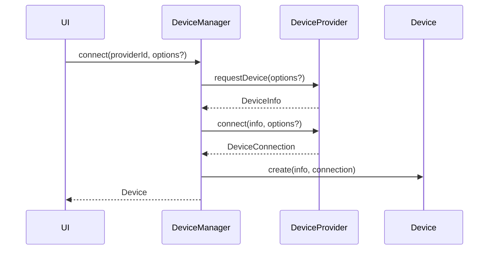
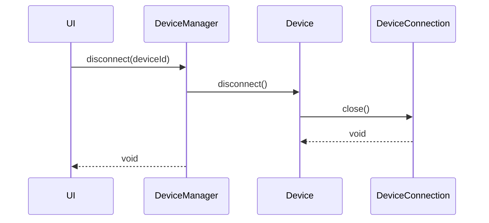

# Device Layer Architecture

## Intent

The Device Layer is the transport-agnostic core of ESP Studio. It defines how the application discovers, connects to, inspects, and disconnects from ESP devices **without** depending on any browser API.

Web Serial, WebUSB, Bluetooth, and Network are **providers** that implement the Device Layer contracts. They are not part of the Device Layer itself.

## Non-negotiable constraints

- No `navigator`, `window`, `document`, `SerialPort`, `USBDevice`, or other browser APIs in `src/core/device`.
- No imports from `src/providers/*`, `src/features/*`, or React.
- Consumers must not need to change when a new provider is registered.
- All public members are documented with JSDoc and use strict TypeScript (`no any`).

## Module contents

```text
src/core/device/
  Device.ts              # Connected device handle
  DeviceInfo.ts          # Static / discovered metadata
  DeviceCapabilities.ts  # Feature flags a connection supports
  DeviceConnection.ts    # Active session contract
  DeviceProvider.ts      # Transport plugin contract
  DeviceManager.ts       # Registry + orchestration
  index.ts               # Public barrel
```

## Responsibility split

| Type                 | Responsibility                                          |
| -------------------- | ------------------------------------------------------- |
| `DeviceInfo`         | Immutable identity and descriptive metadata             |
| `DeviceCapabilities` | What operations a connection can support                |
| `DeviceConnection`   | Live session: status, IO hooks, disconnect              |
| `Device`             | Stable handle combining info + connection lifecycle     |
| `DeviceProvider`     | Discover / request / open connections for one transport |
| `DeviceManager`      | Register providers, open devices, track active set      |

## Dependency direction

```text
UI / features
    │
    ▼
DeviceManager  ──uses──►  DeviceProvider (interface)
    │                           ▲
    ▼                           │
  Device / DeviceConnection     │ implemented by
                                │
                    WebSerialProvider | WebUSBProvider | …
```

## Sequence: connect via injected provider



## Sequence: disconnect



## Replaceability

A provider is replaceable when it:

1. Implements `DeviceProvider`.
2. Is registered with `DeviceManager.registerProvider`.
3. Does not leak transport types through the public Device Layer API.

Flash, Serial Monitor, Filesystem, and OTA modules must consume `Device` /
`DeviceConnection` / optional `connection.io` (`TransportIo`) only.

## Testing strategy

- Unit-test `DeviceManager` with an in-memory fake `DeviceProvider`.
- Provider modules get separate integration tests that may use browser APIs or mocks.
- Core device tests must run in Node without DOM globals.

## Related documents

- [Feature specification](../features/device-layer.md)
- [Architecture overview](./overview.md)
- [Plugin system](./plugin-system.md)
