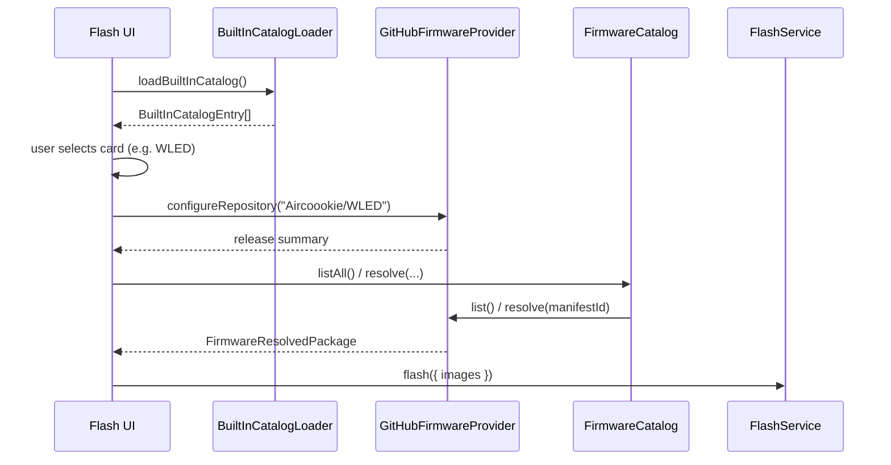

# Feature: Built-in Firmware Catalog (MVP)

## Goal

Ship a static, in-app catalog of popular firmware projects so users can pick WLED, ESPHome, and similar projects without typing a GitHub slug. The catalog only **describes** sources; `GitHubFirmwareProvider` still loads releases and assets.

## Background

`FirmwareCatalog`, `FirmwareProvider`, `FirmwareManifestDocument`, and `GitHubFirmwareProvider` are stable. Flash UI already supports **Local File** and free-text **GitHub Repository**. Users still need to know `owner/repository` for popular projects.

This feature is **not** search, favorites, remote catalog download, category browsing UI, version filtering, OTA, or one-click auto-install.

See also:

- [GitHub Firmware Provider](./github-firmware-provider.md)
- [Firmware Catalog](./firmware-catalog.md)
- [Flash UI](./flash-ui.md)
- [Current roadmap](../roadmap/current.md)

## Purpose

- Define a typed built-in catalog entry model (`id`, `name`, `description`, `repository`, `category`, optional chip families, `icon`, `featured`).
- Ship a static TypeScript data set (no network, no JSON fetch).
- Flash UI source: **Built-in Catalog** | **GitHub Repository** | **Local File**.
- Selecting a built-in card configures `GitHubFirmwareProvider` with that entry’s `owner/repository`.

## Architecture

```text
Flash UI
   │  Built-in Catalog cards (static metadata)
   ▼
BuiltInCatalogLoader → BuiltInCatalog entries
   │  on card select: repository slug
   ▼
GitHubFirmwareProvider.configureRepository(owner/repo)
   │
   ▼
FirmwareCatalog.list / resolve  →  FlashService (unchanged)
```



The built-in catalog is **not** a `FirmwareProvider`. It maps product names to GitHub repositories for the existing provider.

## Catalog format

| Field | Type | Notes |
| ----- | ---- | ----- |
| `id` | `string` | Stable catalog id (e.g. `wled`) |
| `name` | `string` | Display name |
| `description` | `string` | Short blurb |
| `repository` | `string` | `owner/repository` |
| `category` | `BuiltInCatalogCategory` | See categories |
| `chipFamilies` | optional string[] | Compatibility hints only |
| `icon` | `string` | Icon identifier for UI mapping |
| `featured` | `boolean` | Prefer ordering / badge |

Initial data lives in `BuiltInCatalog.ts` as a `as const` / readonly array. `BuiltInCatalogLoader` returns that array (async-capable for a future remote source).

## Categories

| Category id | Intent |
| ----------- | ------ |
| `lighting` | LED / light controllers (e.g. WLED) |
| `home-automation` | Broader home automation firmwares |
| `mqtt` | MQTT / gateway firmwares |
| `firmware` | General / catch-all |

MVP stores `category` on each entry but does **not** ship a categories filter UI.

## Repository mapping

| Entry | Repository |
| ----- | ---------- |
| WLED | `Aircoookie/WLED` |
| ESPHome | `esphome/esphome` |
| Tasmota | `arendst/Tasmota` |
| OpenMQTTGateway | `1technophile/OpenMQTTGateway` |

## Flash UI

| Source | Behavior |
| ------ | -------- |
| Built-in Catalog | Card grid; select → `configureRepository`; then existing GitHub options / resolve / flash |
| GitHub Repository | Free-text `owner/repo` (unchanged) |
| Local File | Local provider + file picker (unchanged) |

## Future remote catalog support

- Keep `BuiltInCatalogEntry` as the shared shape.
- Swap `BuiltInCatalogLoader` to fetch a signed remote JSON list while keeping the same Flash UI.
- Do not embed download URLs or release assets in the built-in list (provider remains responsible).

## Acceptance Criteria

- [x] Feature doc with architecture + sequence diagram.
- [x] Static catalog under `src/features/firmware/catalog/` (no network).
- [x] Flash UI sources: Built-in / GitHub / Local.
- [x] Card select configures `GitHubFirmwareProvider` only.
- [x] No search, favorites, remote catalog, category UI, OTA.
- [x] `pnpm lint` / `typecheck` / `build` pass.

## Future Improvements

- Remote curated catalog JSON.
- Category filter chips.
- Chip-family filtering against identified device.
- Favorites / recently used.

## TODO Checklist

- [x] Documentation reviewed
- [x] Implementation complete
- [x] `pnpm lint` / `pnpm typecheck` / `pnpm build` pass
- [x] Roadmap updated

## Architectural notes (backwards-compatible)

- Built-in catalog is metadata only; it does not extend `FirmwareProvider`.
- Default Flash source becomes **Built-in Catalog** (additive UI; Local/GitHub remain).
- `loadBuiltInCatalog()` returns a `Promise` so a future remote loader can replace the static module without changing Flash call sites.
