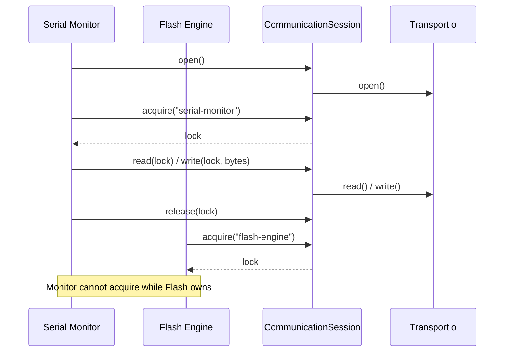

# Feature: Communication Session

## Goal

Provide a single-owner communication layer on top of `TransportIo` that manages exclusive access to the underlying byte stream so Serial Monitor, Flash Engine, and future protocols cannot contend for the same reader/writer.

## Background

`TransportIo` exposes raw `open` / `read` / `write` / `flush` / `close`. It does not enforce who may use the stream. Without an ownership layer, two features could call `read()` concurrently and break Web Serial stream locks.

This feature is **not** a Serial Monitor: no terminal UI, UTF-8 decoding, ANSI, logging, flashing, protocol parsing, or line buffering.

See also:

- [Transport IO feature](./transport-io.md)
- [Device Layer feature](./device-layer.md)
- [Architecture overview](../architecture/overview.md)
- [Current roadmap](../roadmap/current.md)

## Purpose

- Own a single `TransportIo` instance per session.
- Open / close the session (and underlying IO).
- Acquire / release exclusive ownership for one consumer at a time.
- Forward raw `Uint8Array` read/write/flush only to the current owner.
- Prevent multiple simultaneous readers and writers.

## Ownership model

| Concept             | Meaning                                                                          |
| ------------------- | -------------------------------------------------------------------------------- |
| Session             | Wrapper around one `TransportIo` for one connected device stream                 |
| Owner id            | Opaque string identifying the consumer (`"serial-monitor"`, `"flash-engine"`, …) |
| Lock                | Token proving the caller currently owns the session                              |
| Exclusive ownership | At most one owner id may hold the session at a time                              |

Consumers must:

1. Open the session (or ensure it is open).
2. `acquire(ownerId)` → receive a `CommunicationLock`.
3. Perform IO through the session while holding the lock.
4. `release(lock)` when finished (or when switching protocols).

## Lifecycle

```text
closed → opening → open → (owned | idle) → closing → closed
                              │
                              └─ error on hard failures
```

1. Construct `CommunicationSession(transportIo)`.
2. `open()` → opens underlying `TransportIo` if needed.
3. `acquire(ownerId)` → exclusive lock.
4. `read` / `write` / `flush` with the lock (raw bytes only).
5. `release(lock)` → ownership cleared; IO may stay open for the next owner.
6. `close()` → releases ownership if held, closes underlying `TransportIo`.



## Locking strategy

1. **Session lock (exclusive owner)** — `CommunicationLock` tied to one `ownerId`. A second `acquire` throws while held.
2. **Read mutex** — at most one in-flight `read` at a time.
3. **Write mutex** — at most one in-flight `write` or `flush` at a time (shared write path).
4. **Lock validation** — every IO call requires the active lock instance (not merely the owner id string), so stale locks after `release` fail closed.

Releasing a lock does not close the transport; closing the session does.

## Read / write flow

| Operation           | Requirements                   | Behavior                                              |
| ------------------- | ------------------------------ | ----------------------------------------------------- |
| `open()`            | Session not closing            | Opens `TransportIo`; idempotent if open               |
| `close()`           | —                              | Releases active lock, closes `TransportIo`            |
| `acquire(ownerId)`  | Session open; no current owner | Returns `CommunicationLock`                           |
| `release(lock)`     | Lock is current owner          | Clears ownership                                      |
| `read(lock)`        | Valid lock; no read in flight  | Forwards to `TransportIo.read` → `Uint8Array \| null` |
| `write(lock, data)` | Valid lock; no write in flight | Forwards to `TransportIo.write`                       |
| `flush(lock)`       | Valid lock; no write in flight | Forwards to `TransportIo.flush`                       |

## Future protocol support

| Protocol / consumer      | How it uses the session                                        |
| ------------------------ | -------------------------------------------------------------- |
| Serial Monitor           | Acquire ownership, stream bytes, release when leaving the page |
| Flash Engine (esptool)   | Acquire exclusive ownership for the flash duration             |
| Filesystem / OTA helpers | Acquire only for the transfer window                           |
| Plugin tools             | Same acquire/release contract via owner ids                    |

Framing (SLIP, AT commands, etc.) lives **above** this layer.

## Architecture

```text
src/core/communication/
  CommunicationLock.ts
  CommunicationSession.ts
  CommunicationError.ts   # typed errors (optional file or colocated)
  index.ts
```

```text
Serial Monitor / Flash Engine
        │
        ▼
 CommunicationSession  (exclusive ownership + read/write mutexes)
        │
        ▼
   TransportIo  (raw Uint8Array)
```

## Responsibilities

| Component              | Responsibility                                            |
| ---------------------- | --------------------------------------------------------- |
| `CommunicationLock`    | Ownership token for one `ownerId`                         |
| `CommunicationSession` | Own `TransportIo`, lifecycle, acquire/release, forward IO |
| Read/write mutexes     | Prevent concurrent readers and concurrent writers         |

## Public Interfaces

```ts
type CommunicationSessionState =
  "closed" | "opening" | "open" | "closing" | "error";

type CommunicationOwnerId = string;

declare class CommunicationLock {
  readonly ownerId: CommunicationOwnerId;
  readonly isReleased: boolean;
}

declare class CommunicationSession {
  constructor(transport: TransportIo);
  readonly state: CommunicationSessionState;
  readonly ownerId: CommunicationOwnerId | null;
  open(): Promise<void>;
  close(): Promise<void>;
  acquire(ownerId: CommunicationOwnerId): CommunicationLock;
  release(lock: CommunicationLock): void;
  read(lock: CommunicationLock): Promise<Uint8Array | null>;
  write(lock: CommunicationLock, data: Uint8Array): Promise<void>;
  flush(lock: CommunicationLock): Promise<void>;
}
```

## Dependencies

| Dependency             | Required? | Notes                  |
| ---------------------- | --------- | ---------------------- |
| `@/core/transport`     | yes       | Owns one `TransportIo` |
| React / providers / UI | **no**    | Core-only              |
| Text / protocols       | **no**    | Out of scope           |

## Acceptance Criteria

- [x] Feature doc exists.
- [x] `CommunicationSession` owns a `TransportIo` and supports open/close.
- [x] Exclusive acquire/release ownership with `CommunicationLock`.
- [x] Forwards raw `Uint8Array` read/write/flush only to the current owner.
- [x] Prevents multiple simultaneous readers and writers.
- [x] No terminal, UTF-8, ANSI, logging, flashing, protocol parsing, or line buffering.
- [x] Strict TypeScript, no `any`, JSDoc on public APIs.
- [x] `pnpm lint`, `pnpm typecheck`, and `pnpm build` pass.

## Future Improvements

- Async `acquire` that waits/queues instead of failing immediately.
- Transfer ownership between cooperative consumers.
- Integrate session creation into `DeviceManager` / device store.
- Abort in-flight IO when ownership is force-released.
- Metrics for lock wait times.

## TODO Checklist

- [x] Documentation reviewed
- [x] Interfaces designed
- [x] Implementation complete
- [x] Tests added (if applicable) — N/A for this contract milestone
- [x] `pnpm lint` / `pnpm typecheck` / `pnpm build` pass
- [x] Roadmap updated
