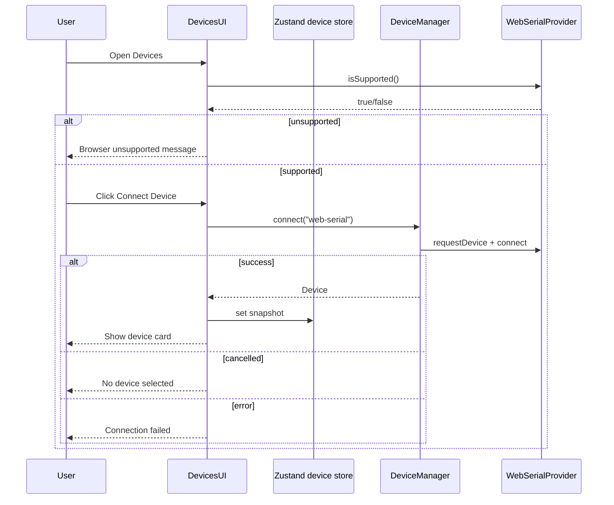

# Feature: Device Discovery UI

## Goal

Wire the existing `WebSerialProvider` and `DeviceManager` into the React app so users can connect a serial device from a user gesture on the Devices page and see connection status, without implementing IO, flashing, or monitoring.

## Background

Device Layer and Web Serial provider are complete. The Devices page still shows a placeholder. This milestone is the first end-to-end UI path: support detection → connect → display device metadata → disconnect.

See also:

- [Web Serial feature](./web-serial.md)
- [Device Layer feature](./device-layer.md)
- [Architecture overview](../architecture/overview.md)
- [Current roadmap](../roadmap/current.md)

## Purpose

- Register `WebSerialProvider` at the application composition root.
- Expose `DeviceManager` to React features through small app infrastructure.
- Replace the Devices placeholder with a real connect / status experience.
- Keep transport details out of UI components (UI talks to `DeviceManager` + store snapshots only).

## User Flow

1. User opens **Devices**.
2. App detects Web Serial support.
3. If unsupported → show a friendly browser-unsupported message; Connect disabled.
4. If supported → user clicks **Connect Device** (user gesture).
5. Browser shows the serial port chooser.
6. On success → Devices page shows name, provider, connection status, and capabilities; shell status updates.
7. On cancel → friendly “No device selected” message.
8. On failure → friendly “Connection failed” message with optional detail.
9. User may **Disconnect** to close the port.



## Browser support

| State                                          | Behavior                                   |
| ---------------------------------------------- | ------------------------------------------ |
| Chromium + secure context + `navigator.serial` | Connect enabled                            |
| Firefox / Safari / missing API                 | Unsupported alert; Connect disabled        |
| Insecure context (non-localhost HTTP)          | Treated as unsupported via `isSupported()` |

## Permission flow

- `requestPort()` runs only inside the Connect button click handler (user gesture).
- No background scanning, no auto-connect on page load.
- Permissions remain browser-owned (see Web Serial feature).

## Error states

| Condition              | UI message (friendly)                              |
| ---------------------- | -------------------------------------------------- |
| Web Serial unsupported | Browser does not support Web Serial…               |
| User cancels chooser   | No device selected                                 |
| Open / connect throws  | Connection failed                                  |
| Disconnect throws      | Disconnect failed (non-blocking toast-style alert) |

## Architecture

```text
src/app/
  device-runtime.ts          # create DeviceManager + register WebSerialProvider
  device-context.tsx         # React context for DeviceManager
  providers.tsx              # composition root (updated)

src/store/
  index.ts                   # device UI snapshot + connect lifecycle flags

src/features/devices/
  devices-page.tsx           # page orchestration
  device-discovery-panel.tsx # support / connect / status UI
```

```text
AppProviders
  └── DeviceManagerProvider (registers WebSerialProvider once)
        └── DevicesFeature
              ├── uses useDeviceManager()
              └── updates useDeviceStore() snapshots for shell + page
```

## Responsibilities

| Component               | Responsibility                                         |
| ----------------------- | ------------------------------------------------------ |
| `createDeviceRuntime`   | Construct `DeviceManager`, register providers          |
| `DeviceManagerProvider` | Hold singleton manager for the React tree              |
| `useDeviceStore`        | UI snapshot: support, connecting, error, active device |
| `DevicesFeature`        | Page header + connect/disconnect actions               |
| `DeviceDiscoveryPanel`  | Status cards, alerts, capability badges                |

## Public Interfaces

```ts
function createDeviceRuntime(): DeviceManager;

type DeviceManagerContextValue = {
  readonly manager: DeviceManager;
};

function useDeviceManager(): DeviceManager;

type DeviceSnapshot = {
  readonly id: string;
  readonly name: string;
  readonly providerId: string;
  readonly providerLabel: string;
  readonly chipFamily: string;
  readonly status: DeviceConnectionState;
  readonly transportLabel?: string;
  readonly capabilities: DeviceCapabilities;
};
```

## Dependencies

| Dependency                                       | Required? | Notes                               |
| ------------------------------------------------ | --------- | ----------------------------------- |
| `@/core/device`                                  | yes       | Manager + types                     |
| `@/providers/web-serial`                         | yes       | Registered only at composition root |
| Zustand                                          | yes       | UI snapshot / shell status          |
| shadcn/ui (Card, Button, Badge, Alert, Skeleton) | yes       | Existing design system              |
| Serial read/write / flash / OTA                  | **no**    | Forbidden in this milestone         |

## Acceptance Criteria

- [x] Feature doc exists.
- [x] `WebSerialProvider` registered in the app composition root.
- [x] Devices page detects Web Serial support.
- [x] Connect Device button requests a port only from a user gesture.
- [x] Connected view shows name, provider, status, capabilities.
- [x] Friendly messages for unsupported / cancelled / failed.
- [x] No serial IO, flashing, OTA, filesystem, auto-reconnect, or background scanning.
- [x] `pnpm lint`, `pnpm typecheck`, `pnpm build` pass.

## Future Improvements

- List previously authorized ports (`getPorts` + `connectToDevice`).
- Multi-device management.
- Live connection-state subscriptions (disconnect events).
- Shared device session for Serial Monitor / Flash Engine.
- Capability-driven navigation (enable Flash only when `capabilities.flash`).

## TODO Checklist

- [x] Documentation reviewed
- [x] Interfaces designed
- [x] Implementation complete
- [x] Tests added (if applicable) — N/A for this UI milestone
- [x] `pnpm lint` / `pnpm typecheck` / `pnpm build` pass
- [x] Roadmap updated
