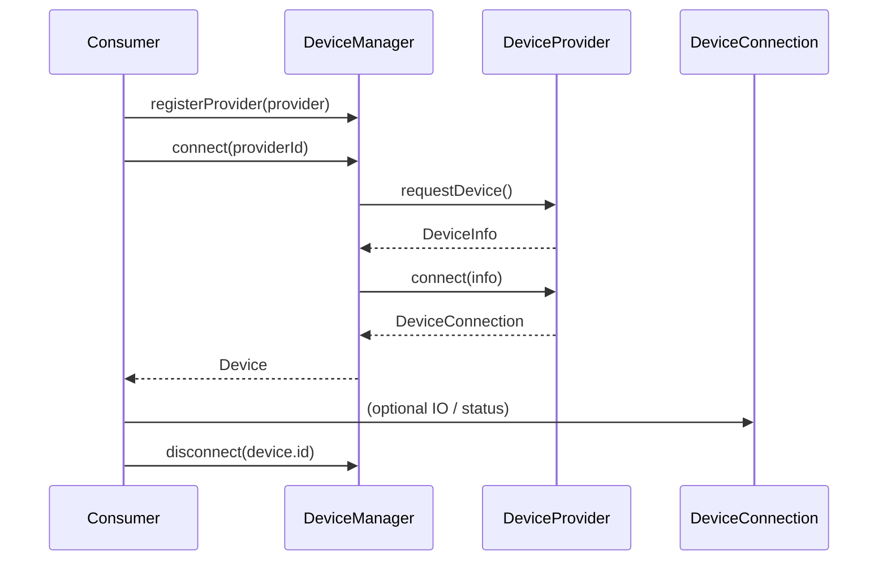

# Feature: Device Layer

## Goal

Provide a transport-agnostic Device Layer so ESP Studio can connect to ESP8266 / ESP32 devices through interchangeable providers (Web Serial, WebUSB, Bluetooth, Network) without coupling consumers to browser APIs.

## Background

The UI foundation already exists. The next product milestone is Core, starting with devices. Implementing Web Serial first would bake a transport into the app. Instead, the Device Layer defines stable contracts and a manager. Providers implement those contracts later.

See also:

- [Architecture overview](../architecture/overview.md)
- [Device Layer architecture](../architecture/device-layer.md)
- [Current roadmap focus](../roadmap/current.md)

## Architecture

```text
src/core/device/
  DeviceInfo.ts
  DeviceCapabilities.ts
  DeviceConnection.ts
  Device.ts
  DeviceProvider.ts
  DeviceManager.ts
  index.ts
```

- **Core-only:** pure TypeScript, no DOM / Web Serial / WebUSB.
- **DI:** `DeviceManager` receives `DeviceProvider` instances via registration.
- **Stable barrel:** consumers import from `@/core/device` (or `src/core/device`).



## Responsibilities

| Component            | Responsibility                                                              |
| -------------------- | --------------------------------------------------------------------------- |
| `DeviceInfo`         | Identity and descriptive metadata for a device                              |
| `DeviceCapabilities` | Declares supported operations for a connection                              |
| `DeviceConnection`   | Live session status and close lifecycle                                     |
| `Device`             | Public handle combining info, capabilities, and connection                  |
| `DeviceProvider`     | Transport-specific discovery and connection factory                         |
| `DeviceManager`      | Provider registry, connect/disconnect orchestration, active device tracking |

## Public Interfaces

### Identity & metadata

```ts
type DeviceId = string;
type ProviderId = string;

type DeviceConnectionState =
  "disconnected" | "connecting" | "connected" | "disconnecting" | "error";

type ChipFamily =
  | "esp8266"
  | "esp32"
  | "esp32-s2"
  | "esp32-s3"
  | "esp32-c3"
  | "esp32-c6"
  | "esp32-h2"
  | "unknown";

interface DeviceInfo {
  readonly id: DeviceId;
  readonly name: string;
  readonly providerId: ProviderId;
  readonly chipFamily: ChipFamily;
  readonly transportLabel?: string;
  readonly metadata?: Readonly<Record<string, string>>;
}
```

### Capabilities

```ts
interface DeviceCapabilities {
  readonly serial: boolean;
  readonly flash: boolean;
  readonly filesystem: boolean;
  readonly ota: boolean;
  readonly baudRateControl: boolean;
}
```

### Connection & device

```ts
interface DeviceConnection {
  readonly state: DeviceConnectionState;
  readonly capabilities: DeviceCapabilities;
  readonly lastError?: Error;
  close(): Promise<void>;
}

interface Device {
  readonly id: DeviceId;
  readonly info: DeviceInfo;
  readonly connection: DeviceConnection;
  readonly capabilities: DeviceCapabilities;
  disconnect(): Promise<void>;
}
```

### Provider & manager

```ts
interface DeviceConnectOptions {
  readonly signal?: AbortSignal;
}

interface DeviceProvider {
  readonly id: ProviderId;
  readonly label: string;
  isAvailable(): boolean | Promise<boolean>;
  listDevices(): Promise<readonly DeviceInfo[]>;
  requestDevice(options?: DeviceConnectOptions): Promise<DeviceInfo>;
  connect(
    info: DeviceInfo,
    options?: DeviceConnectOptions,
  ): Promise<DeviceConnection>;
}

interface DeviceManager {
  registerProvider(provider: DeviceProvider): void;
  unregisterProvider(providerId: ProviderId): void;
  getProvider(providerId: ProviderId): DeviceProvider | undefined;
  listProviders(): readonly DeviceProvider[];
  listDevices(): Promise<readonly DeviceInfo[]>;
  connect(
    providerId: ProviderId,
    options?: DeviceConnectOptions,
  ): Promise<Device>;
  getDevice(deviceId: DeviceId): Device | undefined;
  listConnectedDevices(): readonly Device[];
  disconnect(deviceId: DeviceId): Promise<void>;
  disconnectAll(): Promise<void>;
}
```

### Errors

Providers and the manager SHOULD throw typed errors (or `Error` subclasses) for:

- unknown provider
- unavailable transport
- user cancellation
- connection failure
- disconnect failure

Exact error classes may expand later without breaking successful-path APIs.

## Dependencies

| Dependency                              | Required? | Notes                                       |
| --------------------------------------- | --------- | ------------------------------------------- |
| TypeScript / standard library           | yes       | Only                                        |
| React / DOM                             | **no**    | Forbidden in `src/core/device`              |
| Web Serial / WebUSB                     | **no**    | Belong in future providers                  |
| Existing UI device store                | no        | May adopt Device Layer later                |
| Legacy `src/services/device-service.ts` | no        | Stub; may be migrated after providers exist |

## Acceptance Criteria

- [x] Documentation exists under `docs/architecture`, `docs/roadmap`, and `docs/features`.
- [x] `src/core/device` exports the public API via `index.ts`.
- [x] All public members have JSDoc.
- [x] Strict TypeScript; no `any`; no placeholder stubs that pretend to talk to hardware.
- [x] No browser APIs in the Device Layer.
- [x] `DeviceManager` supports provider registration and connect/disconnect via DI.
- [x] Future providers can be added without changing consumer import sites.
- [x] `pnpm lint`, `pnpm typecheck`, and `pnpm build` pass.

## Future Improvements

- Event emitter / observable for connection state changes.
- Typed error hierarchy (`DeviceError`, `ProviderUnavailableError`, …).
- Persistence of recent `DeviceInfo` records.
- Capability negotiation refinements (baud rates, flash modes).
- Multi-device selection policies.
- Migration of UI store / `deviceService` onto `DeviceManager`.

## Future providers

| Provider  | Package (planned)          | Transport                    |
| --------- | -------------------------- | ---------------------------- |
| WebSerial | `src/providers/web-serial` | Web Serial API               |
| WebUSB    | `src/providers/web-usb`    | WebUSB API                   |
| Bluetooth | `src/providers/bluetooth`  | Web Bluetooth                |
| Network   | `src/providers/network`    | HTTP / WebSocket OTA targets |

## TODO Checklist

- [x] Documentation reviewed (architecture + feature + roadmap)
- [x] Interfaces designed
- [x] Implementation complete
- [x] API is fake-provider-friendly (unit tests can register an in-memory `DeviceProvider`)
- [x] `pnpm lint` / `pnpm typecheck` / `pnpm build` pass
- [x] Roadmap `current.md` / `backlog.md` reflect status after implementation

## Examples

### Register a provider and connect

```ts
import { DeviceManager } from "@/core/device";
import type { DeviceProvider } from "@/core/device";

const manager = new DeviceManager();
manager.registerProvider(myProvider);

const device = await manager.connect(myProvider.id);
console.log(device.info.name, device.capabilities.flash);
await manager.disconnect(device.id);
```

### Minimal fake provider (tests / demos)

```ts
import type {
  DeviceConnection,
  DeviceInfo,
  DeviceProvider,
} from "@/core/device";

const fakeInfo: DeviceInfo = {
  id: "fake-1",
  name: "Fake ESP32",
  providerId: "fake",
  chipFamily: "esp32",
};

const fakeConnection: DeviceConnection = {
  state: "connected",
  capabilities: {
    serial: true,
    flash: true,
    filesystem: false,
    ota: false,
    baudRateControl: true,
  },
  async close() {
    /* mark closed in real fakes */
  },
};

export const fakeProvider: DeviceProvider = {
  id: "fake",
  label: "Fake Provider",
  isAvailable: () => true,
  listDevices: async () => [fakeInfo],
  requestDevice: async () => fakeInfo,
  connect: async () => fakeConnection,
};
```
