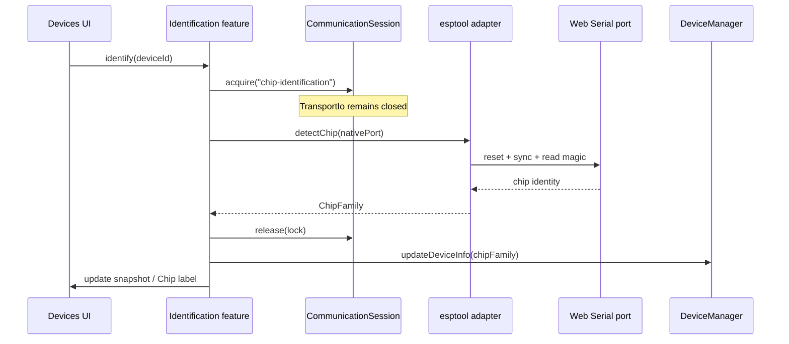

# Feature: ESP Identification

## Goal

Detect the connected Espressif chip family after a device is connected, expose it through the existing Device abstraction, and prepare a reusable esptool adapter boundary for the future Flash Engine—without implementing flashing UI or write/erase/verify.

## Background

Devices connect as `chipFamily: "unknown"`. Flash Engine will need a real chip identity. Identification must use exclusive `CommunicationSession` ownership (`"chip-identification"`), keep `esptool-js` behind an adapter, and update Device + UI snapshots when detection completes.

See also:

- [Communication Session](./communication-session.md)
- [Transport IO](./transport-io.md)
- [Device Discovery](./device-discovery.md)
- [Web Serial](./web-serial.md)
- [Architecture overview](../architecture/overview.md)
- [Current roadmap](../roadmap/current.md)

## Purpose

- Detect chip family for connected ESP boards (8266 / 32 / S2 / S3 / C2 / C3 / C6 / H2).
- Route detection through `CommunicationSession` ownership so Serial Monitor cannot contend.
- Isolate `esptool-js` inside `src/adapters/esptool` so UI/features never import it.
- Update `DeviceInfo.chipFamily` and notify the Devices UI.
- Leave Flash Engine write/erase/verify out of scope.

## How it fits the architecture

```text
Devices UI
   │
   ▼
identification feature  ──owns──►  CommunicationSession ("chip-identification")
   │                                         │
   │                                         └─ exclusive ownership (streams stay free)
   ▼
esptool adapter  ──uses──►  native Web Serial port (provider escape hatch)
   │
   ▼
DeviceManager.updateDeviceInfo() ──► Zustand DeviceSnapshot ──► UI "Chip: ESP32-S3"
```

Layering rules:

| Layer | Role |
| --- | --- |
| `src/features/identification` | Orchestrate ownership, call adapter, update device/UI |
| `src/adapters/esptool` | Only place that imports `esptool-js` |
| `src/providers/web-serial` | Optional native port accessor for adapters |
| `src/core/device` | Additive `updateDeviceInfo` on `DeviceManager` |
| `src/core/communication` | Ownership lock; IO methods unused during native detect |

**Why ownership without opening `TransportIo`?**  
`esptool-js` needs the browser `SerialPort` (including DTR/RTS reset). Opening our `TransportIo` would lock `readable`/`writable` and conflict with esptool’s transport. Identification therefore **acquires** the session while keeping `TransportIo` closed, runs the adapter, then **releases** immediately.

## Detection flow



## Integration with CommunicationSession

| Step | Action |
| --- | --- |
| Owner id | `"chip-identification"` |
| Acquire | Before adapter work; fails if Serial Monitor (or other owner) holds the lock |
| IO via session | Not used for esptool reset/sync (native port used inside adapter only) |
| Release | Always in `finally`, immediately after detection attempt |
| Conflict | If monitor is active, show a friendly “device busy” message |

## Future extensions

- MAC address, crystal frequency, flash size in Device metadata.
- Stub loader attach reused by Flash Engine.
- USB-JTAG/serial reset variants.
- Progress events for long detect/connect attempts.
- Shared session registry coordinating Monitor ↔ Identify ↔ Flash.

## Architecture (packages)

```text
src/adapters/esptool/
  types.ts
  map-chip-name.ts
  device-owned-transport.ts   # Transport subclass: no port close
  esp-tool-chip-identifier.ts # detectChip wrapper
  index.ts

src/features/identification/
  constants.ts
  format-chip-label.ts
  identify-device.ts
  use-chip-identification.ts
  index.ts
```

## Acceptance Criteria

- [x] Feature doc exists.
- [x] Identification acquires/releases `CommunicationSession` with owner `"chip-identification"`.
- [x] `esptool-js` is isolated behind `src/adapters/esptool`.
- [x] Device chip family is updated and Devices UI shows `Chip: ESP32-S3` (or Unknown).
- [x] Designed to support ESP8266, ESP32, S2, S3, C2, C3, C6, H2.
- [x] No flash write/erase/verify, filesystem, OTA, or firmware library UI.
- [x] Strict TypeScript, no `any`, JSDoc; `pnpm lint` / `typecheck` / `build` pass.

## TODO Checklist

- [x] Documentation reviewed
- [x] Implementation complete
- [x] `pnpm lint` / `pnpm typecheck` / `pnpm build` pass
- [x] Roadmap updated
