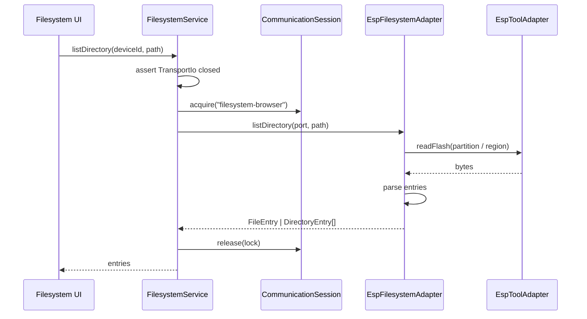

# Feature: Filesystem Browser (MVP)

## Goal

Allow browsing a connected ESP device’s filesystem (directory listing only) and establish the service + adapter architecture that upload, download, and editor integration will reuse later.

## Background

The core flash / firmware platform is stable. Users still cannot inspect on-device storage (SPIFFS / LittleFS). esptool-js exposes raw flash read/write only—no native FS APIs—so browsing is implemented by reading flash through the esptool adapter and parsing filesystem images in a dedicated filesystem adapter.

This feature is **not** upload, download, delete, rename, create folder, drag-and-drop, OTA, or editor integration.

See also:

- [Communication Session](./communication-session.md)
- [Flash Service](./flash-service.md)
- [Transport IO](./transport-io.md)
- [Architecture overview](../architecture/overview.md)
- [Current roadmap](../roadmap/current.md)

## Purpose

- Define abstract filesystem models (`FileEntry`, `DirectoryEntry`) without SPIFFS/LittleFS leakage.
- Ship `FilesystemService` that acquires `CommunicationSession` ownership `"filesystem-browser"`.
- Isolate device IO in `EspFilesystemAdapter` (via `EspToolAdapter.readFlash`, never `esptool-js` from the feature layer).
- Provide a Filesystem page: root listing, expand/collapse folders, sizes, refresh, loading/errors.

## Architecture

```text
Filesystem UI
     │
     ▼
FilesystemService  (owner: filesystem-browser)
     │  CommunicationSession acquire/release
     ▼
EspFilesystemAdapter
     │  uses EspToolAdapter.readFlash (no esptool-js import)
     ▼
Partition table + FS image parse (SPIFFS / LittleFS)
```



## Service layer

`FilesystemService`:

| Method | Behavior |
| ------ | -------- |
| `listDirectory(deviceId, path)` | Acquire ownership, list path, release in `finally` |
| `listRoot(deviceId)` | Convenience for `"/"` |

Requires `TransportIo` **closed** (stop Serial Monitor), same as Flash / Identify.

## Adapter responsibilities

`EspFilesystemAdapter`:

- Accepts the Device Layer native serial port (same type as flash).
- Discovers filesystem volumes from the ESP-IDF partition table (`0x8000`).
- Reads volume flash regions through `EspToolAdapter.readFlash`.
- Parses SPIFFS / LittleFS images into abstract entries.
- Throws typed `FilesystemError` codes; never talks to React or Web Serial globals directly.

## Filesystem model

| Type | Fields |
| ---- | ------ |
| `FileEntry` | `kind: "file"`, `name`, `path`, `size`, `modifiedAt?` |
| `DirectoryEntry` | `kind: "directory"`, `name`, `path`, `children?` (lazy) |
| Shared | Paths use POSIX-style `/…` strings |

Root `/` lists filesystem **volumes** (partition labels) as directories. Expanding a volume lists that filesystem’s entries. Nested directories are supported when the on-disk format exposes them.

## Error handling

| Code | When |
| ---- | ---- |
| `no-device` | Missing connection / native port |
| `busy` | TransportIo open or session owned |
| `not-found` | Path does not exist |
| `unsupported` | No FS partition / unreadable image |
| `io-failure` | Flash read / parse failure |
| `invalid-path` | Malformed path |

## UI

- Device summary + Refresh
- Tree: expand / collapse directories
- File rows show size
- Skeleton while loading; alerts for errors
- No mutate actions

## Acceptance Criteria

- [x] Feature doc with architecture + sequence diagram.
- [x] `FilesystemService` + models + typed errors under `src/features/filesystem/`.
- [x] `EspFilesystemAdapter` under `src/adapters/filesystem/` (no feature→esptool-js).
- [x] Filesystem page: list, expand/collapse, refresh, loading/errors.
- [x] Ownership `"filesystem-browser"` with release in `finally`.
- [x] No upload / download / delete / rename / create.
- [x] `pnpm lint` / `typecheck` / `build` pass.

## Future Improvements

- Upload / download / delete.
- Writable LittleFS/SPIFFS mutation.
- Partition picker when multiple volumes exist.
- Editor open-from-path.

## TODO Checklist

- [x] Documentation reviewed
- [x] Implementation complete
- [x] `pnpm lint` / `pnpm typecheck` / `pnpm build` pass
- [x] Roadmap updated

## Architectural notes (backwards-compatible)

- `EspToolAdapter.readFlash` added for reuse by filesystem (and future tools) without importing `esptool-js` outside `src/adapters/esptool`.
- Web Serial `capabilities.filesystem` set to `true` once browse is available.
