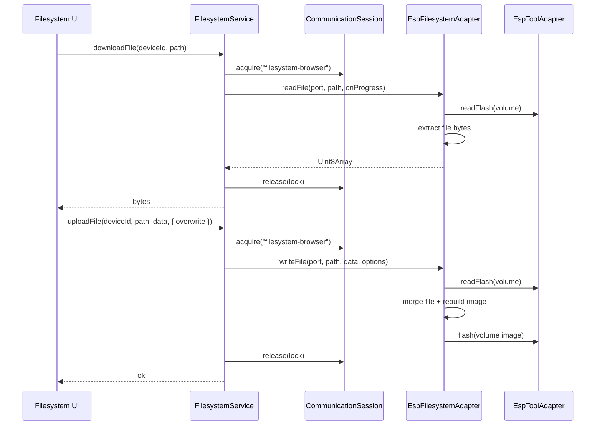

# Feature: Filesystem Upload & Download (MVP)

## Goal

Allow users to upload files to and download files from a connected ESP filesystem volume, reusing `FilesystemService` and `EspFilesystemAdapter`. No rename, delete, create-folder, drag-and-drop, editor, or OTA.

## Background

The Filesystem Browser MVP established browse-only listing over flash-backed SPIFFS / LittleFS images. Transfers extend the same ownership and adapter path: read a volume image, extract or mutate file payloads, and (for upload) rewrite the volume through `EspToolAdapter.flash`.

See also:

- [Filesystem Browser](./filesystem-browser.md)
- [Flash Service](./flash-service.md)
- [Communication Session](./communication-session.md)
- [Current roadmap](../roadmap/current.md)

## Purpose

- Add `downloadFile` / `uploadFile` on `FilesystemService` (owner `"filesystem-browser"`, release in `finally`).
- Extend `EspFilesystemAdapter` with path-level read/write over flash images.
- Surface Upload / Download / Refresh on the Filesystem page with progress and overwrite confirmation.
- Prefer SPIFFS transfers in this MVP; LittleFS transfers are best-effort and may report `unsupported` when the on-disk layout cannot be safely rewritten.

## Architecture

```text
Filesystem UI
     │  Upload / Download / Refresh
     ▼
FilesystemService  (owner: filesystem-browser)
     │  CommunicationSession acquire/release
     ▼
EspFilesystemAdapter
     │  readFlash / flash (via EspToolAdapter)
     ▼
SPIFFS (primary) / LittleFS (best-effort) image extract + rebuild
```



## Upload flow

1. User selects a destination directory (or volume) and chooses **Upload**.
2. Browser file picker provides bytes + suggested filename.
3. Target path = `{selectedDirectory}/{filename}` (POSIX under the volume).
4. If the path already exists and overwrite was not confirmed → `FilesystemError("exists")` and UI prompts confirmation.
5. Service acquires ownership, adapter reads the volume image, replaces/adds the file, rebuilds the image, flashes the partition, reports progress.
6. UI refreshes the listing for the destination directory.

## Download flow

1. User selects a **file** row and chooses **Download**.
2. Service acquires ownership; adapter reads the volume and extracts file bytes.
3. UI triggers a browser download (`Blob` + object URL) named after the entry.
4. Progress covers read + extract stages.

## Progress

`FilesystemTransferProgress`:

| Field | Meaning |
| ----- | ------- |
| `stage` | `preparing` \| `reading` \| `writing` \| `completed` \| `failed` |
| `message` | Human-readable status |
| `percent` | Optional `0`–`100` |
| `bytesTransferred` / `totalBytes` | Optional byte counters |

UI disables Upload / Download / Refresh while a transfer is active and shows a progress bar.

## Errors

| Code | When |
| ---- | ---- |
| `no-device` | Missing connection / native port |
| `busy` | TransportIo open or session owned |
| `not-found` | Download path missing |
| `exists` | Upload path exists and overwrite not allowed |
| `unsupported` | No FS volume / format cannot transfer safely |
| `io-failure` | Flash read/write or image rebuild failure |
| `invalid-path` | Malformed path / upload into `/` without volume |

## Format support (MVP)

| Format | Download | Upload | Notes |
| ------ | -------- | ------ | ----- |
| SPIFFS | Yes | Yes | Primary path; page-size detection + image rebuild |
| LittleFS | Best-effort | Best-effort | Safe rebuild when extractable; otherwise `unsupported` |

## UI

- Buttons: **Upload**, **Download**, **Refresh**
- Selection: click file/directory rows
- Overwrite: confirm dialog before replacing an existing file
- Progress: bar + stage message during transfer
- Disable transfer actions while busy
- No rename / delete / create folder / drag-and-drop

## Acceptance Criteria

- [x] Feature doc with upload/download flows + progress + errors.
- [x] `FilesystemService.downloadFile` / `uploadFile` with `"filesystem-browser"` ownership and `finally` release.
- [x] `EspFilesystemAdapter.readFile` / `writeFile` via `EspToolAdapter` only (no feature→`esptool-js`).
- [x] Filesystem page: Upload, Download, Refresh, progress, overwrite confirm.
- [x] Disable actions while transfer active.
- [x] Friendly typed errors including `exists`.
- [x] No rename / delete / create folder / drag-and-drop / editor / OTA.
- [x] `pnpm lint` / `typecheck` / `test` / `build` pass.

## Future Improvements

- Full LittleFS CTZ directory walking and in-place mutation.
- Delete / rename / create folder.
- Drag-and-drop uploads.
- Partition picker when multiple volumes exist.
- Open file in IDE editor.

## TODO Checklist

- [x] Documentation reviewed
- [x] Implementation complete
- [x] `pnpm lint` / `pnpm typecheck` / `pnpm test` / `pnpm build` pass
- [x] Roadmap updated

## Remaining work before full filesystem management

- Delete, rename, mkdir
- Robust LittleFS mutation (not rebuild-only)
- Drag-and-drop and multi-file selection
- Editor open-from-path
- Safer free-space / wear-leveling aware updates
