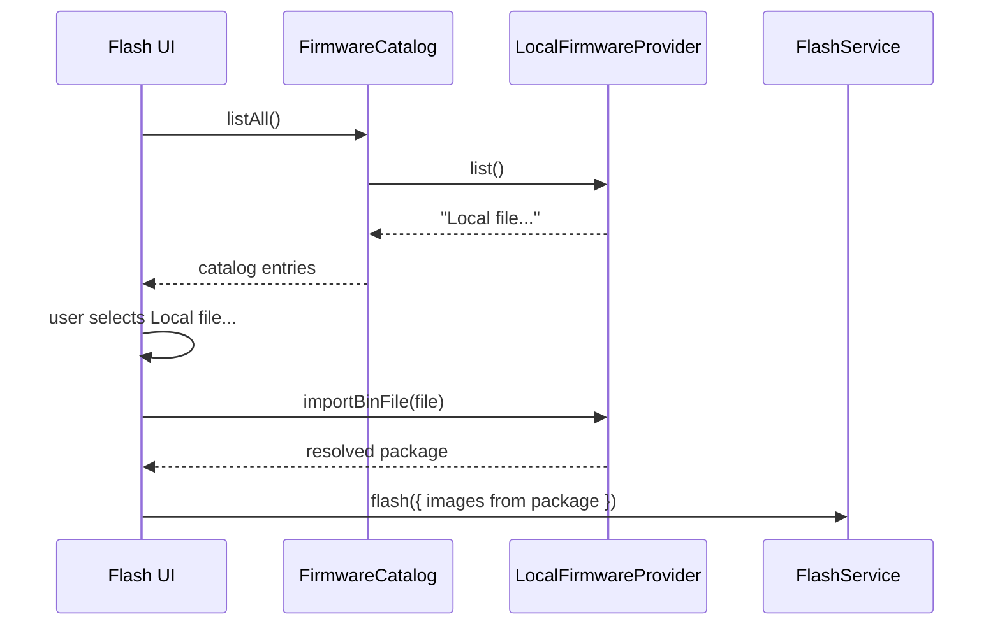

# Feature: Firmware Catalog (MVP)

## Goal

Introduce a reusable firmware catalog abstraction that aggregates multiple providers and supplies installable firmware metadata/images to Flash UI and future one-click installers—without implementing GitHub, downloads, or one-click install yet.

## Background

Flash UI currently picks a local `.bin` directly. That couples the page to the file picker and blocks future sources (GitHub Releases, ESP Web Tools manifests, plugin catalogs). A provider-based catalog becomes the single source of installable firmware.

This feature is **not** one-click install, GitHub integration, remote downloads, OTA, or a full Firmware Library browser.

See also:

- [Flash UI](./flash-ui.md)
- [Flash Service](./flash-service.md)
- [Architecture overview](../architecture/overview.md)
- [Plugin system](../architecture/plugin-system.md)
- [Current roadmap](../roadmap/current.md)

## Purpose

- Define `FirmwareCatalog` + `FirmwareProvider` so Flash UI (and later installers) never hard-code a single firmware source.
- Ship **only** `LocalFirmwareProvider` for user-selected `.bin` files.
- Keep Flash writing on `FlashService` (unchanged flash path).
- Leave GitHub / ESP Web Tools / downloads as documented extension points.

## Catalog architecture

```text
Flash UI / future One-click Install
        │
        ▼
FirmwareCatalog
        │  aggregates
        ├── LocalFirmwareProvider      ← MVP (user .bin)
        ├── GitHubFirmwareProvider     ← future
        └── EspWebToolsProvider        ← future manifests
                │
                ▼
        FirmwareManifest + FirmwareImage[]
                │
                ▼
        FlashService.flash({ images })
```



## Providers

| Provider | Status | Role |
| -------- | ------ | ---- |
| `LocalFirmwareProvider` | MVP | Exposes “Local file…”; imports user `.bin` into a resolved package |
| GitHub Releases | Future | List release assets as manifests; download on resolve |
| ESP Web Tools manifest | Future | Parse `manifest.json` / board install JSON |
| Plugin catalog | Future | Contributions from firmware installer plugins |

## Metadata

| Type | Contents |
| ---- | -------- |
| `FirmwareManifest` | id, title, description?, version?, providerId, sourceKind, optional chipFamilies |
| `FirmwareImage` | id, label, address, size, data (`Uint8Array`) |
| `FirmwareCatalogEntry` | manifest + optional UI action (`pick-local-file`) |
| `FirmwareResolvedPackage` | manifest + images ready for `FlashService` |

## Future GitHub integration

- Provider id `github`.
- List releases / assets matching `.bin` (and later `.zip` partitions).
- `resolve()` downloads into `FirmwareImage.data` (not in this MVP).

## Future ESP Web Tools manifests

- Provider id `esp-web-tools`.
- Fetch/parse install manifests (`builds[].parts[]` address + path).
- Map parts to `FirmwareImage[]` for multi-partition flash later.

## Public Interfaces

```ts
interface FirmwareProvider {
  readonly id: string;
  readonly label: string;
  list(): Promise<readonly FirmwareCatalogEntry[]>;
  resolve(manifestId: string): Promise<FirmwareResolvedPackage>;
}

class FirmwareCatalog {
  constructor(providers: readonly FirmwareProvider[]);
  listProviders(): readonly FirmwareProvider[];
  getProvider(id: string): FirmwareProvider | undefined;
  listAll(): Promise<readonly FirmwareCatalogEntry[]>;
  resolve(providerId: string, manifestId: string): Promise<FirmwareResolvedPackage>;
}

class LocalFirmwareProvider implements FirmwareProvider {
  importBinFile(file: File, address?: number): Promise<FirmwareResolvedPackage>;
  clear(): void;
}
```

## Acceptance Criteria

- [x] Feature doc exists.
- [x] Catalog supports multiple providers; only `LocalFirmwareProvider` implemented.
- [x] Flash page selects firmware from the catalog (“Local file…” → file picker).
- [x] Flash still uses `FlashService`.
- [x] No GitHub, downloads, or one-click install.
- [x] Strict TypeScript; `pnpm lint` / `typecheck` / `build` pass.

## Future Improvements

- GitHub Releases provider.
- ESP Web Tools manifest provider.
- Firmware Library page browsing the catalog.
- One-click install orchestration.
- Persist recent local files (File System Access API).

## TODO Checklist

- [x] Documentation reviewed
- [x] Implementation complete
- [x] `pnpm lint` / `pnpm typecheck` / `pnpm build` pass
- [x] Roadmap updated
