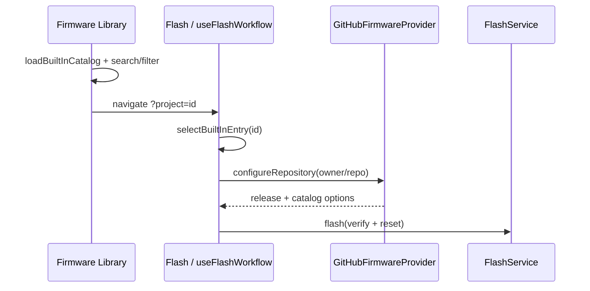

# Feature: Firmware Library

## Goal

Create the primary firmware browsing experience. The Firmware Library is where users discover popular projects and start the existing one-click install flow. No new catalog/provider abstractions.

## Background

Built-in Catalog, GitHub Firmware Provider, Firmware Catalog, Flash Service, and One-click Install already power `/flash`. The `/firmware` route was still a placeholder. This milestone turns it into a product browse surface that deep-links into Flash.

See also:

- [Built-in Firmware Catalog](./built-in-firmware-catalog.md)
- [One-click Install](./one-click-install.md)
- [GitHub Firmware Provider](./github-firmware-provider.md)
- [Flash UI](./flash-ui.md)
- [Current roadmap](../roadmap/current.md)

## Purpose

- Browse popular firmware from `BuiltInCatalog` with search and categories.
- Show recently used projects (localStorage) and a placeholder for install history.
- Each card: name, description, chips, repository, latest version, **Install**.
- Install navigates to `/flash?project=<id>` and reuses `useFlashWorkflow` + `FlashPanel` + `FlashService`.

## Navigation

| Path | Role |
| ---- | ---- |
| `/firmware` | Library browse (this feature) |
| `/flash?project=<builtInId>` | One-click Install surface (existing) |

Sidebar **Firmware** opens the library. Dashboard copy points users here to discover firmware.

## Installation flow

```text
Library card Install
     │  remember recent id (localStorage)
     ▼
navigate /flash?project=wled
     │
     ▼
useFlashWorkflow.selectBuiltInEntry(id)
     │  GitHubFirmwareProvider.configureRepository
     │  FirmwareCatalog.resolve preferred option
     ▼
FlashPanel Install Firmware → FlashService.flash
```



## Library model

Reuse `BuiltInCatalogEntry` only (no parallel library schema):

| Field | Source |
| ----- | ------ |
| Name / description / category / chips / repository | Built-in catalog |
| Latest version | `fetchLatestRelease` (lazy per card) |
| Recently used | `localStorage` id list |
| Installed history | Placeholder UI only |

Search is client-side over the static catalog (name, description, repository, category). No remote search.

## UI

- Popular (featured) section
- Categories filter chips
- Search field
- Recently used section
- Installed history placeholder
- Cards with Install CTA

## Out of scope

Remote search, authentication, ratings, reviews, downloads counters, telemetry, OTA.

## Acceptance Criteria

- [x] Feature doc complete.
- [x] `src/features/library/` page, card, category, search modules.
- [x] Library lists built-in catalog with search + categories.
- [x] Cards show name, description, chips, repository, latest version, Install.
- [x] Install opens existing one-click flow via `/flash?project=…`.
- [x] Recently used + installed-history placeholder.
- [x] No remote search / auth / ratings / OTA.
- [x] `pnpm lint` / `typecheck` / `test` / `build` pass.

## Future Improvements

- Persist install history after successful flashes.
- Favorites / pins.
- Remote curated catalog JSON.
- In-library install panel (optional; Flash remains canonical).

## TODO Checklist

- [x] Documentation reviewed
- [x] Implementation complete
- [x] Quality gates pass
- [x] Roadmap updated
