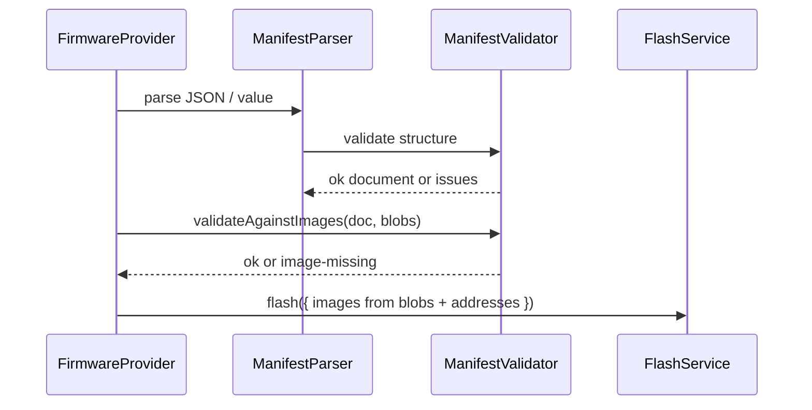

# Feature: Firmware Manifest

## Goal

Define the canonical firmware manifest format used throughout ESP Studio—the contract between Firmware Providers and FlashService—including schema versioning, validation, and typed errors. Do not implement GitHub, downloads, or remote fetching.

## Background

The Firmware Catalog introduced runtime types (`FirmwareManifest`, `FirmwareImage`, `FirmwareResolvedPackage`). Providers and future one-click install need a **serializable JSON document** that:

1. Declares package metadata and chip compatibility.
2. Describes image layout (ids, addresses, optional paths/sizes/checksums).
3. Can be validated before flashing.
4. Evolves via `schemaVersion` without breaking older documents.

This feature is **not** GitHub integration, HTTP downloads, ESP Web Tools fetching, or one-click install UI.

See also:

- [Firmware Catalog](./firmware-catalog.md)
- [Flash Service](./flash-service.md)
- [Flash UI](./flash-ui.md)
- [Current roadmap](../roadmap/current.md)

## Purpose

- Canonical JSON document: `FirmwareManifestDocument` (`schemaVersion: 1`).
- Parse unknown JSON → typed document or typed validation issues.
- Validate required fields, duplicate addresses/ids, chip families, and image existence (when blobs are supplied).
- Keep catalog summary `FirmwareManifest` as the lightweight runtime projection used by UI listing.

## JSON schema (version 1)

Top-level object:

| Field | Type | Required | Notes |
| ----- | ---- | -------- | ----- |
| `schemaVersion` | `1` | yes | Only `1` accepted today |
| `id` | string | yes | Non-empty package id |
| `title` | string | yes | Display title |
| `description` | string | no | Longer blurb |
| `version` | string | no | Release / semver string |
| `sourceKind` | `"local" \| "github" \| "esp-web-tools" \| "remote"` | yes | Origin kind |
| `providerId` | string | no | Filled by provider when known |
| `chipFamilies` | string[] | no | Empty/omitted = any chip; else ESP Studio chip ids |
| `images` | object[] | yes | At least one image |

Each `images[]` entry:

| Field | Type | Required | Notes |
| ----- | ---- | -------- | ----- |
| `id` | string | yes | Unique within the document |
| `label` | string | yes | Human label (`application`, `bootloader`, …) |
| `address` | number \| hex string | yes | Absolute flash offset (`4096` or `"0x1000"`) |
| `path` | string | no | Relative path for future bundles / remotes |
| `size` | number | no | Expected byte length when known |
| `sha256` | string | no | Lowercase hex digest (future verify) |

### Complete example — single app image (local)

```json
{
  "schemaVersion": 1,
  "id": "demo-app",
  "title": "Demo Application",
  "description": "Minimal ESP32-S3 application image.",
  "version": "1.0.0",
  "sourceKind": "local",
  "providerId": "local",
  "chipFamilies": ["esp32-s3"],
  "images": [
    {
      "id": "app",
      "label": "application",
      "address": "0x10000",
      "path": "firmware.bin",
      "size": 524288
    }
  ]
}
```

### Complete example — multi-image layout (future provider)

```json
{
  "schemaVersion": 1,
  "id": "factory-bundle",
  "title": "Factory Bundle",
  "version": "2.1.0",
  "sourceKind": "esp-web-tools",
  "chipFamilies": ["esp32", "esp32-s2", "esp32-s3"],
  "images": [
    {
      "id": "bootloader",
      "label": "bootloader",
      "address": "0x0",
      "path": "bootloader.bin",
      "size": 28672
    },
    {
      "id": "partition-table",
      "label": "partition-table",
      "address": "0x8000",
      "path": "partition-table.bin",
      "size": 3072
    },
    {
      "id": "app",
      "label": "application",
      "address": "0x10000",
      "path": "app.bin",
      "size": 1048576,
      "sha256": "e3b0c44298fc1c149afbf4c8996fb92427ae41e4649b934ca495991b7852b855"
    }
  ]
}
```

## Versioning

| Rule | Behavior |
| ---- | -------- |
| Current | `FIRMWARE_MANIFEST_SCHEMA_VERSION = 1` |
| Unknown version | Validation fails with `unsupported-schema-version` |
| Additive fields | Allowed in future minors of the same `schemaVersion` only if ignored by older validators |
| Breaking changes | Require `schemaVersion` bump |

## Metadata

Runtime catalog summary (`FirmwareManifest`) remains the UI/list projection:

`id`, `title`, `description?`, `version?`, `providerId`, `sourceKind`, `chipFamilies?`

Document → summary helper: `toCatalogManifest(document, providerId)`.

## Image layout

- Addresses are absolute and unique within a document.
- Order in `images[]` is the preferred flash order for providers/UI.
- `path` is a logical artifact key (not fetched in this feature).
- Resolved flash payloads stay in `FirmwareImage.data` after provider resolve.

## Device compatibility

Allowed `chipFamilies` values match Device Layer `ChipFamily` **except** `"unknown"`:

`esp8266`, `esp32`, `esp32-s2`, `esp32-s3`, `esp32-c2`, `esp32-c3`, `esp32-c6`, `esp32-h2`

- Omitted or empty `chipFamilies` → compatible with any connected chip.
- Non-empty list → every entry must be a supported family id.

## Validation

| Check | Code |
| ----- | ---- |
| Missing/empty required field | `missing-field` |
| Wrong JSON type | `invalid-type` |
| `schemaVersion` ≠ 1 | `unsupported-schema-version` |
| Unsupported chip id | `unsupported-chip-family` |
| Two images share an address | `duplicate-address` |
| Two images share an id | `duplicate-image-id` |
| `images` empty | `empty-images` |
| Address not a finite non-negative integer | `invalid-address` |
| Provided blob map missing image id / empty bytes | `image-missing` |
| Declared `size` ≠ blob length | `image-size-mismatch` |

Results are discriminated unions with typed `FirmwareManifestValidationIssue[]`.

## Architecture

```text
JSON / unknown
   │
   ▼
FirmwareManifestParser  ──uses──►  FirmwareManifestValidator
   │                                         │
   ▼                                         ▼
FirmwareManifestDocument            typed issues | ok document
   │
   ├── toCatalogManifest()  → FirmwareManifest (catalog list)
   └── provider resolve     → FirmwareImage[] → FlashService
```



## Public Interfaces

```ts
parseFirmwareManifestJson(text: string): FirmwareManifestParseResult
parseFirmwareManifestValue(value: unknown): FirmwareManifestParseResult

validateFirmwareManifestDocument(
  document: FirmwareManifestDocument,
  options?: { images?: ReadonlyMap<string, Uint8Array> | readonly FirmwareImage[] },
): FirmwareManifestValidationResult

toCatalogManifest(document: FirmwareManifestDocument, providerId: string): FirmwareManifest
```

## Acceptance Criteria

- [ ] Feature doc with schema, examples, versioning, validation.
- [ ] `FirmwareManifestSchema.ts`, `FirmwareManifestValidator.ts`, `FirmwareManifestParser.ts`.
- [ ] Validates required fields, duplicate addresses, chip families, image existence.
- [ ] Typed validation errors (no `any`).
- [ ] No GitHub, downloads, or remote manifest fetching.
- [ ] `pnpm lint` / `typecheck` / `build` pass.

## Future Improvements

- SHA-256 verification against `images[].sha256`.
- ESP Web Tools manifest → document adapter.
- GitHub release asset → document adapter.
- Chip filtering in Flash UI from `chipFamilies`.

## TODO Checklist

- [x] Documentation reviewed
- [ ] Implementation complete
- [ ] `pnpm lint` / `pnpm typecheck` / `pnpm build` pass
- [ ] Roadmap updated
