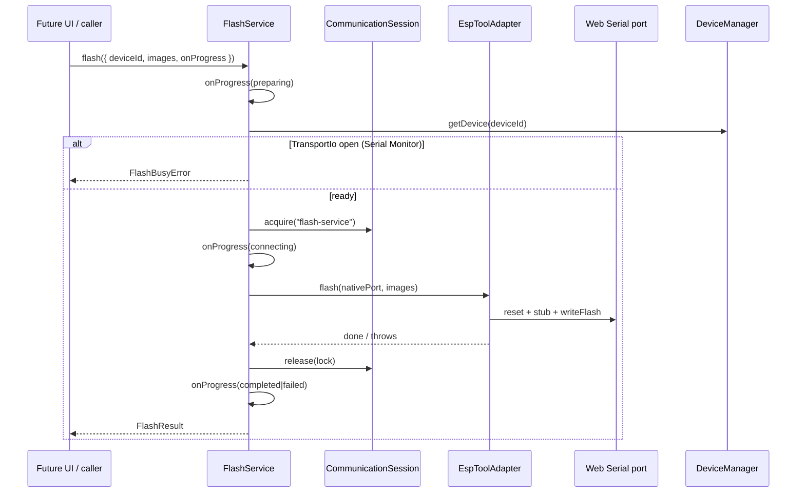

# Feature: Flash Service (MVP)

## Goal

Provide a reusable orchestration service that performs firmware identify / erase / flash / verify / reset against a connected device through the existing esptool adapter boundary—without shipping Flash UI, a firmware library, or downloads.

## Background

ESP Identification established `src/adapters/esptool`, native-port access, and `CommunicationSession` ownership for chip detect. Flash Engine / Flash UI need a higher-level service that:

1. Acquires exclusive ownership (`"flash-service"`).
2. Drives esptool operations behind the adapter.
3. Reports structured progress future React components can render.
4. Returns typed results and friendly ownership errors.

This feature is **not** a Flash page, firmware catalog, OTA, filesystem browser, plugin host, progress dialog, or serial terminal.

See also:

- [ESP Identification](./esp-identification.md)
- [Communication Session](./communication-session.md)
- [Transport IO](./transport-io.md)
- [Web Serial](./web-serial.md)
- [Architecture overview](../architecture/overview.md)
- [Current roadmap](../roadmap/current.md)

## Purpose

- Expose `FlashService` APIs: `identify`, `erase`, `inspectPreFlash`, `flash`, `verify`, `reset`.
- Keep `esptool-js` behind `EspToolAdapter` (`src/adapters/esptool`).
- Acquire / release `CommunicationSession` with owner `"flash-service"` (never leave a lock behind).
- Emit reusable `FlashProgress` stages for future UI (includes `inspecting`).
- Remain callable from any future Flash page, CLI helper, or test harness.

Pre-write safety: see [Pre-Flash Firmware Inspection](./pre-flash-inspection.md).

## Architecture

```text
Future Flash UI / callers
        │
        ▼
src/features/flash/FlashService
        │  owns CommunicationSession ("flash-service")
        │  resolves device via DeviceManager
        ▼
src/adapters/esptool/EspToolAdapter   ← only esptool-js import site for flash ops
        │
        ▼
native Web Serial port (provider escape hatch)
```



### Why `TransportIo` stays closed

Same rationale as identification: esptool needs native `SerialPort` stream locks and DTR/RTS. Opening `TransportIo` would contend. Flash Service acquires ownership while IO remains closed, runs the adapter, then releases.

## Responsibilities

| Component | Responsibility |
| --------- | -------------- |
| `FlashService` | Orchestrate ownership, resolve device/port, call adapter, report progress, map errors |
| `FlashProgress` | Stage + percent model reusable by React |
| `FlashOptions` / `FlashResult` | Caller contracts (images, baud, callbacks, outcomes) |
| `errors.ts` | Typed busy / device / operation failures |
| `EspToolAdapter` | Isolate `esptool-js` for identify / erase / write / verify / reset |
| `CommunicationSession` | Exclusive ownership lock |
| `DeviceManager` | Lookup connected device; optional chip metadata update on identify |

## Ownership model

| Step | Action |
| ---- | ------ |
| Owner id | `"flash-service"` |
| Precondition | Device connected; `TransportIo.state === "closed"` |
| Acquire | Before any adapter work |
| Release | Always in `finally` |
| Conflict | Another owner / open TransportIo → `FlashBusyError` with friendly message |

## Progress reporting

```ts
type FlashStage =
  | "preparing"
  | "connecting"
  | "erasing"
  | "writing"
  | "verifying"
  | "resetting"
  | "completed"
  | "failed";

type FlashProgress = {
  readonly stage: FlashStage;
  readonly message: string;
  readonly percent?: number;
  readonly fileIndex?: number;
  readonly bytesWritten?: number;
  readonly bytesTotal?: number;
};
```

Listeners are optional sync callbacks (`onProgress`). No React dependency in the service.

## Error handling

| Error | When |
| ----- | ---- |
| `FlashBusyError` | Serial Monitor (or other tool) holds the stream / ownership |
| `FlashDeviceError` | Missing device, transport, provider, or native port |
| `FlashOperationError` | Adapter / esptool failure (wrapped with `cause`) |

All flash errors extend `FlashError`. Callers may still receive `FlashResult` with `success: false` for non-throwing APIs, or methods may throw—MVP throws typed errors and also returns a result object for uniformity.

## Public Interfaces

```ts
class FlashService {
  constructor(manager: DeviceManager, adapter?: EspToolAdapter);
  identify(deviceId: string, options?: FlashOperationOptions): Promise<FlashResult>;
  erase(deviceId: string, options?: FlashOperationOptions): Promise<FlashResult>;
  flash(options: FlashOptions): Promise<FlashResult>;
  verify(options: FlashVerifyOptions): Promise<FlashResult>;
  reset(deviceId: string, options?: FlashOperationOptions): Promise<FlashResult>;
}
```

## Dependencies

| Dependency | Required? | Notes |
| ---------- | --------- | ----- |
| `DeviceManager` | yes | Device + connection lookup |
| `CommunicationSession` | yes | Ownership |
| `EspToolAdapter` | yes | Only place flash ops touch esptool-js |
| `WebSerialProvider.getNativePort` | yes | Escape hatch for native port (same as identification) |
| React / Flash page | no | Forbidden in this MVP |
| Firmware library / OTA | no | Forbidden |

**Forbidden:** importing `esptool-js` from `src/features/flash` or any UI module.

## Acceptance Criteria

- [x] Feature doc exists (`docs/features/flash-service.md`).
- [x] `FlashService` exposes identify / erase / flash / verify / reset.
- [x] Ownership uses `"flash-service"` and always releases in `finally`.
- [x] Busy conflicts return a friendly typed error.
- [x] Progress model covers preparing → completed / failed stages.
- [x] UI never depends on `esptool-js`; adapter isolation preserved.
- [x] No Flash page UI, firmware library, OTA, filesystem, plugins, dialogs, or terminal output.
- [x] Strict TypeScript, no `any`, JSDoc; `pnpm lint` / `typecheck` / `build` pass.

## Future Improvements

- Shared session registry coordinating Monitor ↔ Identify ↔ Flash.
- AbortSignal cancellation mid-write.
- Higher baud rates after stub (with safe reconnect semantics).
- Flash page UI consuming `FlashProgress`.
- Firmware library supplying `FlashImage[]`.
- Parallel multi-image verify reporting.

## TODO Checklist

- [x] Documentation reviewed
- [x] Interfaces designed
- [x] Implementation complete
- [ ] Tests added (if applicable)
- [x] `pnpm lint` / `pnpm typecheck` / `pnpm build` pass
- [x] Roadmap updated (`docs/roadmap/current.md`, `backlog.md` if needed)

## Process reminder

1. Create or update documentation first.
2. Implement only after the feature doc is complete.
3. Do not overwrite unrelated existing documentation.
4. Prefer the most maintainable architectural option when trade-offs appear.
