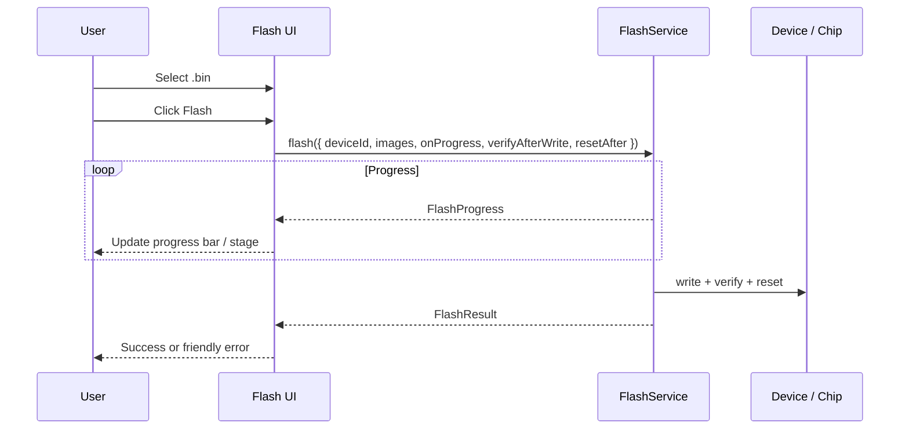

# Feature: Flash UI (MVP)

## Goal

Ship the first complete local-firmware flashing workflow: select a `.bin`, flash it to a connected ESP board through `FlashService`, and show live progress and friendly errors—without a firmware library or OTA.

## Background

`FlashService` already provides `identify` / `erase` / `flash` / `verify` / `reset` with `FlashProgress` events. The Flash page is still a placeholder. Users need a minimal UI that wires device state, a single local file, and progress display.

This feature is **not** a firmware catalog, GitHub Releases installer, OTA updater, multi-partition editor, bootloader picker, or settings panel.

See also:

- [Flash Service](./flash-service.md)
- [Pre-Flash Firmware Inspection](./pre-flash-inspection.md)
- [ESP Identification](./esp-identification.md)
- [Device Discovery](./device-discovery.md)
- [Communication Session](./communication-session.md)
- [Current roadmap](../roadmap/current.md)

## User flow

1. User connects a device on **Devices** (chip may already be identified).
2. User opens **Flash**.
3. Page shows connected device name, status, and chip type (or prompts to connect).
4. User picks one local `.bin` file; size is shown.
5. User clicks **Flash firmware**.
6. Controls disable; live `FlashProgress` stages / percent update.
7. On success: result message; optional chip update from the service.
8. On failure: friendly alert (busy, no file, unsupported browser, flash/verify failed).



## Flash lifecycle (UI)

| Stage | UI treatment |
| ----- | ------------ |
| Idle | Device card + file picker + Flash button |
| Preparing / Connecting / Writing / Verifying / Resetting | Progress bar + stage badge; controls disabled |
| Completed | Success alert + 100% progress |
| Failed | Destructive alert with friendly message |

MVP flashes a single image at application offset **`0x10000`** (documented in UI). Partition editing is out of scope.

## Progress display

- Bind `onProgress` from `FlashService.flash` to React state.
- Show stage label + message + `Progress` percent when available.
- Use `Skeleton` only if needed for initial device hydration (usually not).

## Error handling

| Condition | UI |
| --------- | -- |
| No device connected | Info/warning alert + link cue to Devices |
| Browser unsupported | Warning alert (Web Serial missing) |
| No file selected | Validation message; Flash button disabled |
| Non-`.bin` file | Reject with friendly message |
| Device busy (`FlashBusyError`) | Destructive alert: stop Serial Monitor |
| Flash / verify failed | Destructive alert with service message |
| Success | Success-styled alert |

## Architecture

```text
src/pages/flash-page.tsx          thin route wrapper
src/features/flash/flash-page.tsx FlashFeature composition
src/features/flash/flash-panel.tsx UI surface
src/features/flash/use-flash-workflow.ts  file + FlashService hook
src/components/ui/progress.tsx    shadcn-style progress bar
```

UI imports **`FlashService` only** — never `esptool-js`.

## Responsibilities

| Component | Responsibility |
| --------- | -------------- |
| `FlashFeature` | Page header + panel |
| `FlashPanel` | Device info, file picker, progress, errors, Flash button |
| `useFlashWorkflow` | File bytes, progress state, call `FlashService.flash` |
| `FlashService` | Existing orchestration (unchanged API) |

## Acceptance Criteria

- [x] Feature doc exists.
- [x] Flash page shows device info, chip type, file picker, size, Flash button, progress, result.
- [x] Supports one local `.bin` via `FlashService`.
- [x] Live `FlashProgress`; controls disabled while flashing.
- [x] Friendly errors for no device, unsupported browser, no file, busy, flash/verify failure.
- [x] No firmware library, OTA, multi-partition, bootloader, or settings UI.
- [x] Strict TypeScript; `pnpm lint` / `typecheck` / `build` pass.

## Future Improvements

- Multi-file / partition map UI.
- Configurable flash address.
- Firmware library one-click install.
- Abort in-flight flash.
- Remember last file handle (File System Access API).

## TODO Checklist

- [x] Documentation reviewed
- [x] Implementation complete
- [x] `pnpm lint` / `pnpm typecheck` / `pnpm build` pass
- [x] Roadmap updated
