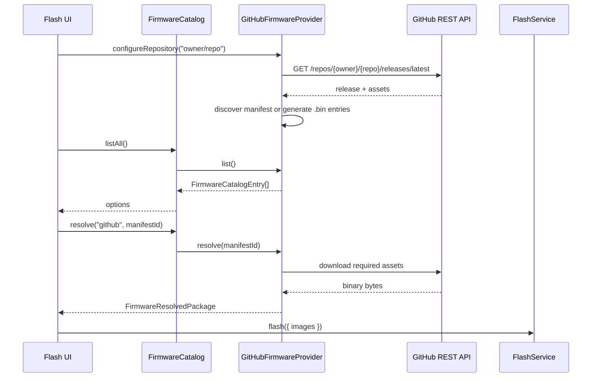

# Feature: GitHub Firmware Provider (MVP)

## Goal

Implement the first remote `FirmwareProvider` that loads firmware from GitHub Releases into the existing `FirmwareCatalog`, keeping FlashService and Flash UI free of GitHub-specific APIs beyond configuring this provider.

## Background

Firmware Catalog + Manifest Document are stable. Local files already flow through `LocalFirmwareProvider`. Remote install needs another provider that:

1. Talks to the GitHub Releases REST API.
2. Discovers an ESP Studio manifest (or falls back to `.bin` assets).
3. Downloads assets only on `resolve()`.
4. Exposes catalog entries Flash UI can select like any other source.

This feature is **not** GitHub auth, repo search, rate-limit retries, ESP Web Tools, OTA, or one-click auto-install.

See also:

- [Firmware Catalog](./firmware-catalog.md)
- [Firmware Manifest](./firmware-manifest.md)
- [Flash UI](./flash-ui.md)
- [Flash Service](./flash-service.md)
- [Current roadmap](../roadmap/current.md)

## Purpose

- Add `GitHubFirmwareProvider` implementing `FirmwareProvider`.
- Discover manifests / generate `.bin` options from the latest release.
- Lazy-download assets in `resolve()` into `FirmwareImage[]`.
- Let Flash UI choose **Local File** vs **GitHub Repository** without importing GitHub REST types.

## Architecture

```text
Flash UI
   │  configures slug / selects catalog entry
   ▼
FirmwareCatalog
   ├── LocalFirmwareProvider
   └── GitHubFirmwareProvider  ← only GitHub REST + download logic
            │
            ▼
     GitHub REST API (releases/latest + asset URLs)
            │
            ▼
     parse/validate FirmwareManifestDocument (reuse)
            │
            ▼
     FlashService.flash({ images })
```



GitHub-specific DTOs (`GitHubRelease`, `GitHubAsset`) stay inside `providers/github/`. The UI may import the provider class, repository slug helpers, summary type, and typed errors only.

## GitHub Releases API

| Call | Purpose |
| ---- | ------- |
| `GET /repos/{owner}/{repo}/releases/latest` | Latest published release + asset list |
| Asset `browser_download_url` | Download manifest JSON or `.bin` bytes on resolve |

Unauthenticated public API only. No tokens, search, or retry loops in MVP.

## Manifest discovery

For the latest release, search assets for **exactly one** of:

- `esp-studio.json`
- `firmware.json`
- `manifest.json`

| Result | Behavior |
| ------ | -------- |
| Exactly one | Download → `parseFirmwareManifestJson` → validate → one catalog entry (`origin: "manifest"`) |
| More than one | Typed `duplicate-manifests` error (do not guess) |
| None | Fallback mode (below) |

## Fallback mode

If no manifest asset exists:

- Enumerate every asset whose name ends with `.bin` (case-insensitive).
- Expose each as a catalog option with default flash address `0x10000`.
- Mark entry `origin: "generated"`.
- Do **not** fail solely because a manifest is missing.

## Asset resolution (`resolve`)

- Manifest-backed: download each image by matching `images[].path` (basename) to a release asset name; missing asset → typed error.
- Generated `.bin`: download that single asset into one `FirmwareImage` at `DEFAULT_APP_FLASH_ADDRESS`.
- Never eagerly download firmware during `list()` / configure (manifest JSON download during discovery is allowed).

## Download lifecycle

1. Configure repository → fetch release metadata (+ optional manifest JSON).
2. `list()` returns cached catalog entries (no firmware blobs).
3. User selects entry → `catalog.resolve` → provider downloads required binaries.
4. Return `FirmwareResolvedPackage` for FlashService.

### Browser CORS note

GitHub release CDNs do not allow cross-origin reads of asset bytes. In
`pnpm dev` / `pnpm preview`, downloads go through the same-origin Vite proxy
at `/__esp-studio/github-asset` (`vite.github-asset-proxy.ts`). Static hosts
without an equivalent proxy cannot download GitHub release binaries in-browser
unless assets are served with CORS (same constraint as ESP Web Tools).

## Flash UI

| Element | Behavior |
| ------- | -------- |
| Source | `Local File` \| `GitHub Repository` |
| Repo field | `owner/repository` (example `wled-dev/WLED`) |
| Persistence | `localStorage` key for last repository slug |
| After load | Repository, latest release tag/name, published date, firmware options |
| Flash | Unchanged `FlashService` path |

## Error handling

| Condition | Typed code / class |
| --------- | ------------------ |
| Repo not found (404) | `repository-not-found` |
| No latest release (404) | `release-not-found` |
| Network / fetch failure | `network-failure` |
| Invalid manifest JSON/schema | `invalid-manifest` |
| Multiple manifest filenames | `duplicate-manifests` |
| Unsupported `schemaVersion` | `unsupported-manifest-version` |
| Required asset missing on resolve | `missing-firmware-assets` |

UI maps these to friendly alerts; raw `fetch` errors are wrapped.

## Acceptance Criteria

- [x] Feature doc with architecture + sequence diagram.
- [x] `GitHubFirmwareProvider` implements `FirmwareProvider` under `providers/github/`.
- [x] Manifest discovery + `.bin` fallback; lazy downloads on `resolve()`.
- [x] Flash UI Local / GitHub source with persisted repo slug.
- [x] Typed provider errors; no GitHub REST types outside the provider package.
- [x] No auth, search, retries, ESP Web Tools, OTA, auto-install.
- [x] `pnpm lint` / `typecheck` / `build` pass.

## Future Improvements

- Release picker (not only latest).
- Authenticated API + higher rate limits.
- SHA-256 verify from manifest.
- ESP Web Tools provider.

## TODO Checklist

- [x] Documentation reviewed
- [x] Implementation complete
- [x] `pnpm lint` / `pnpm typecheck` / `pnpm build` pass
- [x] Roadmap updated

## Architectural notes (backwards-compatible)

- Optional `FirmwareCatalogEntry.origin?: "manifest" | "generated"` marks GitHub fallback rows without changing existing providers.
- Vite same-origin proxy (`/__esp-studio/github-asset`) downloads release assets during `pnpm dev` / `pnpm preview` because GitHub CDNs block browser CORS.
