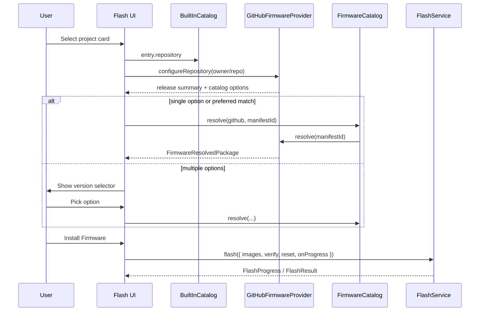

# Feature: One-click Install (MVP)

## Goal

Reduce flashing to the fewest user actions: connect a device, pick a firmware project (and a version when needed), then click **Install Firmware**. Configuration, release loading, and (when unambiguous) option selection happen automatically.

## Background

The firmware platform is feature-complete: `FirmwareCatalog`, `BuiltInCatalog`, `GitHubFirmwareProvider`, `FlashService`, and `DeviceManager` are stable. Flash UI still requires manual option selection after loading a release. One-click Install is a **UX layer** over those services—no new providers or domain abstractions.

This feature is **not** OTA, filesystem, ESP Web Tools, search, favorites, or plugins.

See also:

- [Built-in Firmware Catalog](./built-in-firmware-catalog.md)
- [GitHub Firmware Provider](./github-firmware-provider.md)
- [Flash UI](./flash-ui.md)
- [Flash Service](./flash-service.md)
- [Current roadmap](../roadmap/current.md)

## User journey

1. Connect an ESP board on **Devices** (chip may already be identified).
2. Open **Flash**.
3. Select a built-in project card (or advanced GitHub / Local source).
4. App configures GitHub, loads the latest release, and resolves firmware when only one option exists (or prefers a chip-compatible option when several exist).
5. If multiple options remain, user picks a firmware version/image.
6. Review summary (device, chip, project, version, size).
7. Click **Install Firmware** → download (if not already resolved) is already done; flash + verify + reset run via `FlashService`.
8. Watch `FlashProgress`; see success or a friendly error.

## Installation lifecycle

| Phase | Automatic? | Notes |
| ----- | ---------- | ----- |
| Configure GitHub provider | Yes (on project select) | Reuses `configureRepository` |
| Load latest release | Yes | Same as GitHub provider MVP |
| List firmware options | Yes | Via `FirmwareCatalog` |
| Select option | Auto if one; else user | Prefer chip-compatible |
| Resolve / download assets | Yes on select | Lazy `resolve()` |
| Flash + verify + reset | On Install click | `FlashService.flash` |
| Progress UI | Yes | Existing `FlashProgress` |

## Automatic decisions

- **One option** → select + resolve immediately; Install enabled.
- **Multiple options** → prefer entries compatible with the connected chip (when known); still list all; resolve the preferred option so Install is ready; user can change selection.
- **Empty chip families** on an option → treated as compatible with any chip.
- **Incompatible preferred/selected** → show a warning, do not hide the option.

## Connected device summary

Display:

- Device name
- Chip
- Firmware project
- Firmware version (release tag / option version)
- Firmware size

## Error handling

| Condition | UI |
| --------- | -- |
| No device | Info/warning + link to Devices; Install disabled |
| Repository unavailable | Provider error alert |
| Invalid / unsupported manifest | Provider error alert |
| No firmware options | Warning after load |
| Flash busy | Destructive alert (stop Serial Monitor) |
| Verification / flash failed | Destructive alert with service message |
| Network failure | Provider / network alert |

## Acceptance Criteria

- [x] Feature doc with user journey + sequence diagram.
- [x] Project select auto-configures GitHub and loads latest release.
- [x] Single option auto-selected and resolved; Install enabled.
- [x] Multiple options show a selector; chip preference + warning (not hide).
- [x] Primary action **Install Firmware** runs flash/verify/reset with progress.
- [x] Summary shows device, chip, project, version, size.
- [x] No new providers; reuse catalog / GitHub / FlashService.
- [x] `pnpm lint` / `typecheck` / `build` pass.

## Future Improvements

- Release tag picker (not only latest).
- True one-shot Install without pre-download (resolve inside Install).
- Dedicated Install page separate from advanced Local/GitHub tools.

## TODO Checklist

- [x] Documentation reviewed
- [x] Implementation complete
- [x] `pnpm lint` / `pnpm typecheck` / `pnpm build` pass
- [x] Roadmap updated
