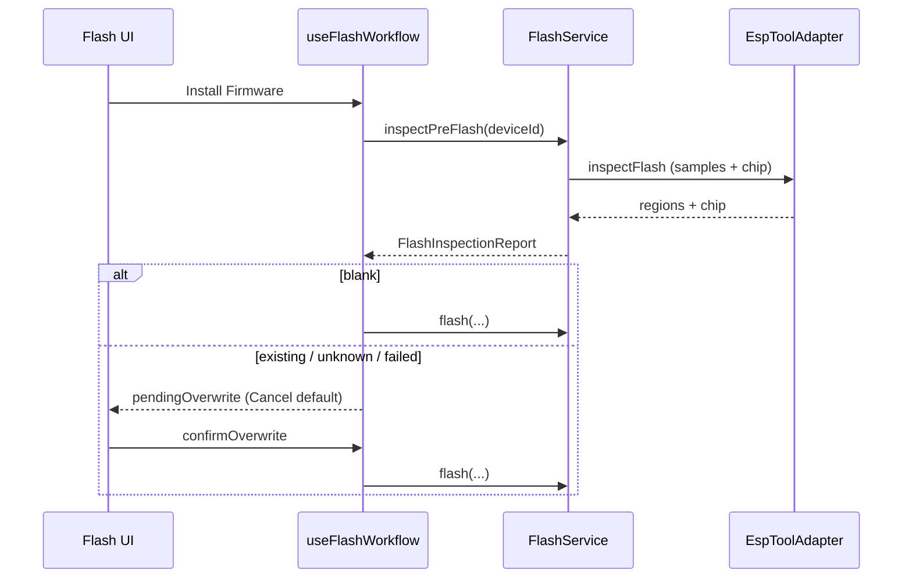

# Feature: Pre-Flash Firmware Inspection

## Goal

Before any flash write starts, inspect the target device’s flash so ESP Studio never overwrites an existing installation without explicit confirmation.

## Background

Install Firmware / Flash Local File currently call `FlashService.flash` immediately. Users need a safety gate when the chip already holds an image. Architecture is frozen: reuse `FlashService`, `EspToolAdapter.readFlash`, and existing Identify metadata — no new abstraction layers and no invented firmware identity.

See also:

- [Flash Service](./flash-service.md)
- [Flash UI](./flash-ui.md)
- [ESP Identification](./esp-identification.md)
- [Device Operation Lock](./device-operation-lock.md)

## Architecture

```text
Flash UI (Install)
   │
   ▼
useFlashWorkflow.startFlash
   │  FlashService.inspectPreFlash (same flash-service lock)
   ▼
EspToolAdapter.inspectFlash
   samples @ 0x0 / 0x1000 / 0x10000 + identify + optional flash size
   │
   ├─ blank      → info banner, continue flash
   ├─ existing   → confirm Alert (Cancel default)
   ├─ unknown    → confirm Alert (Cancel default)
   └─ failed     → confirm Alert (Cancel default)
```



## Detection strategy

Sample 32 bytes at common offsets:

| Address | Intent |
| ------- | ------ |
| `0x0` | Bootloader / first sector (ESP32-C3 and similar) |
| `0x1000` | Classic ESP32 / ESP8266 bootloader offset |
| `0x10000` | Default application image (`DEFAULT_APP_FLASH_ADDRESS`) |

Classification of each sample:

| Condition | Region status |
| --------- | ------------- |
| Every byte `0xFF` | `blank` |
| First byte `0xE9` (ESP image magic) | `image` |
| Otherwise | `unknown` |

Aggregate report:

| Outcome | Rule |
| ------- | ---- |
| `blank` | All sampled regions are `blank` |
| `existing` | Any region is `image` |
| `unknown` | Not blank, no `0xE9` seen |
| `failed` | Read / connect / ownership error |

Chip metadata comes only from Identify / DeviceManager (`chipFamily`, optional `espToolChipName`). Optional flash size string comes from `detectFlashSize()` when available — never invented product names or versions for the **installed** image.

The confirmation dialog may also list the **incoming** package (project / version the user selected) because that is known from the Flash catalog — clearly labeled as the firmware being installed.

## Responsibilities

| Component | Responsibility |
| --------- | -------------- |
| `flash-inspection.ts` | Pure classify helpers + report types |
| `EspToolAdapter` | `inspectFlash` (samples + chip + optional size) in one bootloader session |
| `FlashService.inspectPreFlash` | Ownership + progress + adapter orchestration |
| `useFlashWorkflow` | Gate Install behind pending overwrite confirm |
| `FlashPanel` | Blank info / overwrite confirm Alert (Cancel default) |

## Public Interfaces

```ts
type FlashRegionStatus = "blank" | "image" | "unknown";

type FlashInspectionOutcome =
  | "blank"
  | "existing"
  | "unknown"
  | "failed";

type FlashInspectionReport = {
  readonly outcome: FlashInspectionOutcome;
  readonly message: string;
  readonly chipFamily?: ChipFamily;
  readonly rawChipName?: string;
  readonly flashSize?: string;
  readonly regions: readonly {
    readonly address: number;
    readonly status: FlashRegionStatus;
  }[];
};
```

## Dependencies

| Dependency | Required? | Notes |
| ---------- | --------- | ----- |
| `FlashService` / `EspToolAdapter` | yes | Existing |
| Identify / DeviceManager chip snapshot | yes | No duplicate identify logic |
| Dialog/modal package | no | Alert + buttons (filesystem overwrite pattern) |
| Firmware format parsers | **no** | Magic/`0xFF` only |

## When confirmation is shown

| Device outcome | Package kind | UI | Confirmation? |
| -------------- | ------------ | -- | ------------- |
| `blank` | `application-only` | Stop — cannot boot on empty ESP | N/A (blocked) |
| `blank` | `complete` | “This device appears to be empty.” | **No** — continue |
| `existing` / `unknown` / `failed` | `application-only` | App-only preserve message | **Yes** — Cancel default |
| `existing` / `unknown` / `failed` | `complete` | Overwrite warning | **Yes** — Cancel default |

Package kind comes from manifest `packageKind` or image role labels — see [Flash Pipeline Robustness](./flash-pipeline-robustness.md).

## Acceptance Criteria

- [x] Feature doc exists.
- [x] Install / Local File path inspects before write.
- [x] Blank devices skip confirm.
- [x] Existing / unknown / failed require overwrite confirm (Cancel default).
- [x] No invented installed firmware identity.
- [x] `pnpm lint` / `typecheck` / `test` / `build` pass.

## Future Improvements

- Parse app descriptor / ELF notes when safe.
- Single bootloader session for inspect+write after confirm.
- Chip-specific bootloader offset table.

## TODO Checklist

- [x] Documentation reviewed
- [x] Implementation complete
- [x] Tests added
- [x] Quality gates
