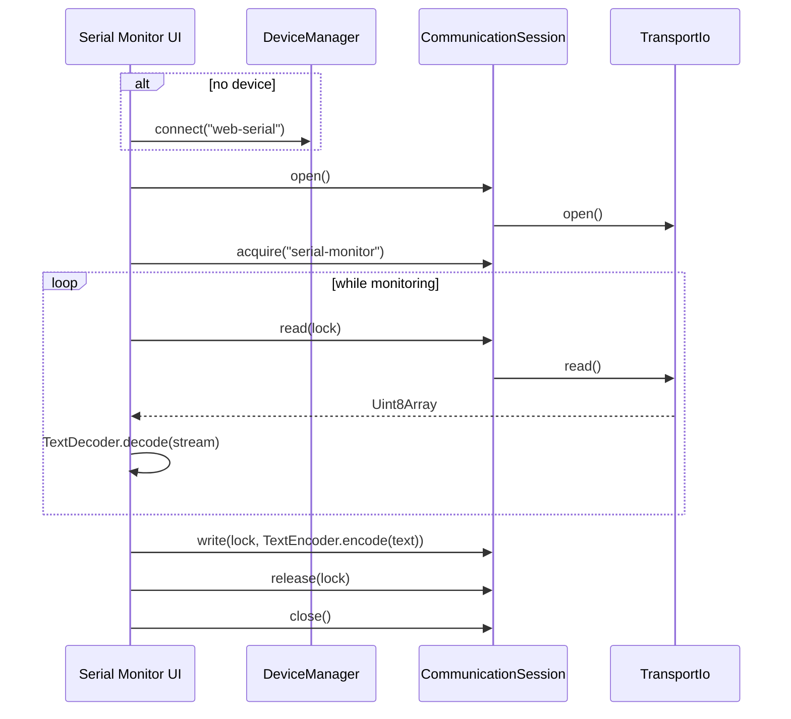

# Feature: Serial Monitor (Minimal)

## Goal

Ship the first usable Serial Monitor UI that streams live UTF-8 text over an existing device connection using `CommunicationSession` ownership (`"serial-monitor"`), without terminal emulation or protocol features.

## Background

Device Discovery, Web Serial, `TransportIo`, and `CommunicationSession` are in place. The Serial page is still a placeholder. This milestone makes connect → own stream → view output → send text → release ownership work end to end.

See also:

- [Communication Session](./communication-session.md)
- [Transport IO](./transport-io.md)
- [Device Discovery](./device-discovery.md)
- [Web Serial](./web-serial.md)
- [Current roadmap](../roadmap/current.md)

## Purpose

- Live serial output in the React Serial page.
- Acquire exclusive `CommunicationLock` with owner `"serial-monitor"`.
- Decode inbound bytes with `TextDecoder`; encode outbound text with `TextEncoder`.
- Connect from the Serial page when no device is connected; disconnect and clear output.
- Auto-scroll output; release the lock when stopping/closing.

## Data flow

```text
Device (Web Serial)
  → DeviceConnection.io (TransportIo)
    → CommunicationSession
      → read/write Uint8Array
        → TextDecoder / TextEncoder (UI layer only)
          → React output / input
```



## Session ownership

| Step              | Action                                                                                    |
| ----------------- | ----------------------------------------------------------------------------------------- |
| Start monitor     | `new CommunicationSession(device.connection.io)` → `open()` → `acquire("serial-monitor")` |
| Running           | Only this owner may read/write                                                            |
| Stop / unmount    | Stop read loop → `release(lock)` → `close()` session                                      |
| Disconnect device | Stop monitor first, then `DeviceManager.disconnect`                                       |

Owner id constant: `"serial-monitor"`.

## UTF-8 decoding

- Inbound: `TextDecoder` with `{ stream: true }` so multi-byte characters spanning chunks decode correctly.
- Outbound: `TextEncoder.encode(text)` before `session.write`.
- No ANSI, no line ending normalization, no hex mode.

## Lifecycle

1. User opens Serial Monitor.
2. If unsupported browser → show alert.
3. If no device → **Connect** (user gesture) via `DeviceManager` + Web Serial.
4. On connected device with `connection.io` → start session + acquire lock + read loop.
5. User may **Send** text, **Clear** output, **Disconnect**.
6. On leave/stop → release lock and close session (device may remain connected until Disconnect).

## Architecture

```text
src/features/serial/
  constants.ts              # SERIAL_MONITOR_OWNER_ID
  use-serial-monitor.ts     # session + read loop + connect helpers
  serial-monitor-panel.tsx  # output / input / actions UI
  serial-page.tsx           # page orchestration
```

## Responsibilities

| Component            | Responsibility                                                   |
| -------------------- | ---------------------------------------------------------------- |
| `useSerialMonitor`   | Connect/disconnect, session open/acquire/read loop/release/close |
| `SerialMonitorPanel` | Output pane, send form, clear, status alerts                     |
| `SerialFeature`      | Page header + panel wiring                                       |

## Acceptance Criteria

- [x] Feature doc exists.
- [x] Uses `CommunicationSession` with owner `"serial-monitor"`.
- [x] Live output with auto-scroll; send text; connect if needed; disconnect; clear.
- [x] UTF-8 via `TextDecoder` / `TextEncoder`.
- [x] Releases `CommunicationLock` when closing/stopping.
- [x] No ANSI, terminal emulation, logging, timestamps, filters, hex, themes, line-ending config, history, macros, flash, filesystem, OTA.
- [x] `pnpm lint`, `pnpm typecheck`, `pnpm build` pass.

## Future Improvements

- Baud rate controls, timestamps, filters, hex view.
- ANSI / xterm.js terminal.
- Persist scrollback limits / export logs.
- Pause/resume without releasing ownership.
- Share one app-level session registry for Flash handoff.

## TODO Checklist

- [x] Documentation reviewed
- [x] Interfaces designed
- [x] Implementation complete
- [x] `pnpm lint` / `pnpm typecheck` / `pnpm build` pass
- [x] Roadmap updated
