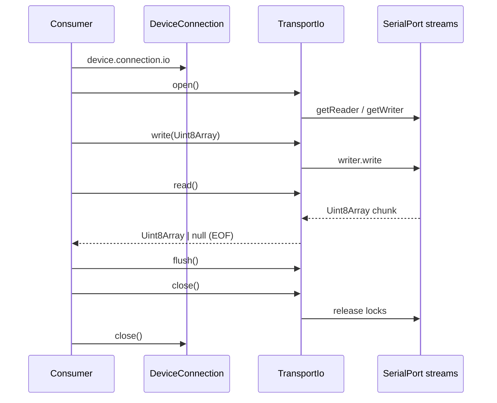

# Feature: Transport IO Layer

## Goal

Provide a transport-agnostic raw byte stream API (`TransportIo`) so Serial Monitor, Flash Engine, and future tools can read and write `Uint8Array` data without depending on Web Serial, WebUSB, TCP, or BLE specifics.

## Background

Devices can already be connected through `DeviceManager` + `WebSerialProvider`. `DeviceConnection` currently only exposes lifecycle/status. Higher-level features need a stable IO contract **before** Serial Monitor or flashing exist.

This feature is **not** a Serial Monitor: no terminal UI, ANSI parsing, logging, line buffering, or packet framing.

See also:

- [Device Layer feature](./device-layer.md)
- [Web Serial feature](./web-serial.md)
- [Device Discovery feature](./device-discovery.md)
- [Architecture overview](../architecture/overview.md)
- [Current roadmap](../roadmap/current.md)

## Purpose

- Define `TransportIo` in core with `open` / `close` / `read` / `write` / `flush`.
- Use `Uint8Array` exclusively at the transport boundary.
- Attach IO to connections that can stream bytes (starting with Web Serial).
- Keep browser stream APIs inside `src/providers/web-serial`.

## Responsibilities

| Component              | Responsibility                                                      |
| ---------------------- | ------------------------------------------------------------------- |
| `TransportIo`          | Transport-agnostic byte stream contract                             |
| `TransportIoState`     | Lifecycle of the IO session (distinct from device connection state) |
| `TransportIoError`     | Typed failures for open/read/write/close                            |
| `DeviceConnection.io`  | Optional link from a live connection to its byte stream             |
| `WebSerialTransportIo` | Web Serial readable/writable bridge implementing `TransportIo`      |
| `WebSerialConnection`  | Owns port lifecycle and exposes `io`                                |

## Architecture

```text
src/core/transport/
  TransportIo.ts
  TransportIoError.ts
  index.ts

src/core/device/DeviceConnection.ts   # additive optional `io`
src/providers/web-serial/
  WebSerialTransportIo.ts             # Uint8Array over SerialPort streams
  WebSerialConnection.ts              # exposes `io`, closes IO on disconnect
```

```text
Serial Monitor / Flash Engine (future)
        │
        ▼
   TransportIo  (core contract, Uint8Array only)
        ▲
        │ implemented by
 WebSerialTransportIo | WebUsbTransportIo | TcpTransportIo | BleTransportIo
```



## Read / Write contract

| Operation     | Behavior                                                                                                                                 |
| ------------- | ---------------------------------------------------------------------------------------------------------------------------------------- |
| `open()`      | Prepare the byte stream (acquire reader/writer). Idempotent if already open.                                                             |
| `close()`     | Release stream locks. Idempotent if already closed. Does **not** replace `DeviceConnection.close()` for tearing down the device session. |
| `read()`      | Resolve with the next `Uint8Array` chunk, or `null` on EOF / stream end.                                                                 |
| `write(data)` | Write the given `Uint8Array` (callers must not mutate the buffer until the promise settles).                                             |
| `flush()`     | Wait until buffered outbound bytes are accepted by the transport (backpressure cleared).                                                 |

All payloads are **binary** (`Uint8Array`). Text encoding/decoding is a consumer concern.

## Binary vs Text

- Transport IO is binary-only.
- UTF-8 / line splitting / ANSI belong in Serial Monitor or protocol adapters later.
- Flash Engine will also consume raw bytes (SLIP framing lives above this layer).

## Stream lifecycle

1. Provider opens the device transport (`port.open` for Web Serial) → `DeviceConnection` is `connected`.
2. Consumer calls `connection.io?.open()` to start byte streaming.
3. Consumer reads/writes/flushes as needed.
4. Consumer calls `io.close()` to release stream locks (optional if disconnecting immediately).
5. Consumer / manager calls `connection.close()` which closes IO (if open) then the underlying port.

States: `closed` → `opening` → `open` → `closing` → `closed`, with `error` on hard failures.

## Error handling

| Condition                            | Error                                             |
| ------------------------------------ | ------------------------------------------------- |
| `read`/`write`/`flush` before `open` | `TransportIoNotOpenError`                         |
| Underlying stream missing / locked   | `TransportIoError`                                |
| Write/read failure                   | `TransportIoError` with `cause`                   |
| Operations after fatal error         | `TransportIoError` until re-opened (if supported) |

Closing after errors should still attempt to release locks.

## Future transports

| Transport       | Notes                                               |
| --------------- | --------------------------------------------------- |
| Web Serial      | First implementation (`WebSerialTransportIo`)       |
| WebUSB          | Custom endpoints mapped to the same `TransportIo`   |
| TCP / WebSocket | Network providers for OTA / remote bridges          |
| BLE             | Characteristic notifications + writes as chunked IO |

Consumers depend only on `TransportIo`; new transports require no consumer changes.

## Public Interfaces

```ts
type TransportIoState = "closed" | "opening" | "open" | "closing" | "error";

type TransportIoOpenOptions = {
  readonly signal?: AbortSignal;
};

type TransportIoReadOptions = {
  readonly signal?: AbortSignal;
};

type TransportIoWriteOptions = {
  readonly signal?: AbortSignal;
};

interface TransportIo {
  readonly state: TransportIoState;
  readonly lastError?: Error | undefined;
  open(options?: TransportIoOpenOptions): Promise<void>;
  close(): Promise<void>;
  read(options?: TransportIoReadOptions): Promise<Uint8Array | null>;
  write(data: Uint8Array, options?: TransportIoWriteOptions): Promise<void>;
  flush(options?: TransportIoWriteOptions): Promise<void>;
}

// Additive on DeviceConnection:
interface DeviceConnection {
  readonly io?: TransportIo | undefined;
  // ...existing fields
}
```

## Dependencies

| Dependency                | Required?      | Notes                                  |
| ------------------------- | -------------- | -------------------------------------- |
| TypeScript / `Uint8Array` | yes            | Core only                              |
| React / UI                | **no**         | Forbidden in core transport            |
| Web Serial streams        | yes (provider) | Only inside `src/providers/web-serial` |
| Text / line parsers       | **no**         | Out of scope                           |

## Acceptance Criteria

- [x] `docs/features/transport-io.md` exists.
- [x] Core exports a transport-agnostic `TransportIo` API using `Uint8Array`.
- [x] `DeviceConnection` optionally exposes `io` without breaking existing callers.
- [x] Web Serial implements `TransportIo` with browser APIs confined to the provider.
- [x] No terminal UI, ANSI parsing, logging, Serial Monitor, flash engine, packet parser, or line buffering.
- [x] Strict TypeScript, no `any`, JSDoc on public APIs.
- [x] `pnpm lint`, `pnpm typecheck`, and `pnpm build` pass.

## Future Improvements

- Async iterable `readable` helper over `read()`.
- Concurrent read cancellation via `AbortSignal` wired to reader cancel.
- Flow-control metrics / high-water marks.
- Half-duplex modes for flashing bootloaders.
- Shared IO session guard so Monitor and Flash cannot fight for the same reader — see [Communication Session](./communication-session.md).

## TODO Checklist

- [x] Documentation reviewed
- [x] Interfaces designed
- [x] Implementation complete
- [x] Tests added (if applicable) — N/A for this contract milestone
- [x] `pnpm lint` / `pnpm typecheck` / `pnpm build` pass
- [x] Roadmap updated
