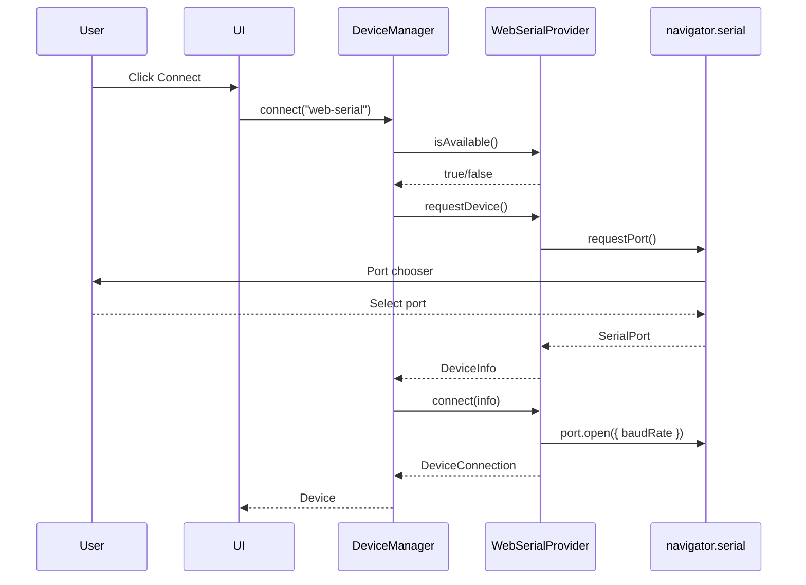

# Feature: Web Serial Provider

## Goal

Provide the first concrete `DeviceProvider` implementation using the browser Web Serial API, so ESP Studio can request, open, and close serial ports without coupling the Device Layer or UI to transport details.

## Background

The Device Layer (`src/core/device`) is transport-agnostic. Web Serial is the first provider on the roadmap after Device Layer. This milestone intentionally stops at connect/disconnect: no flashing, serial streaming, parsing, OTA, or filesystem.

See also:

- [Device Layer feature](./device-layer.md)
- [Device Layer architecture](../architecture/device-layer.md)
- [Architecture overview](../architecture/overview.md)
- [Current roadmap](../roadmap/current.md)

## Purpose

- Bridge `navigator.serial` to the existing `DeviceProvider` / `DeviceConnection` contracts.
- Keep all browser-specific code inside `src/providers/web-serial`.
- Remain easy to replace with WebUSB, Bluetooth, or Network providers.

## Browser requirements

| Requirement      | Detail                                                                                                 |
| ---------------- | ------------------------------------------------------------------------------------------------------ |
| API              | [Web Serial API](https://developer.mozilla.org/en-US/docs/Web/API/Web_Serial_API) (`navigator.serial`) |
| Secure context   | HTTPS or `http://localhost`                                                                            |
| User gesture     | `requestPort()` must run from a user gesture (click, etc.)                                             |
| Typical browsers | Chromium-based (Chrome, Edge, Opera). **Not** supported in Firefox or Safari as of this writing.       |

## Limitations

- No read/write streaming API exposed yet (Serial Monitor is a later milestone).
- No baud-rate change after open in this minimal version (baud is chosen at open).
- No flashing, esptool-js, packet parsing, logging, OTA, filesystem, or auto-reconnect.
- Chip family is reported as `"unknown"` until a later identification step exists.
- Port identity is provider-local; unplugging may invalidate stored handles.
- `getPorts()` only returns ports the origin was previously granted.

## Security model

- The browser owns permission grants; ESP Studio never bypasses the chooser.
- Ports are origin-scoped; revoking site permissions forgets authorized ports.
- The provider does not persist credentials or raw port objects outside memory.
- Core and UI never receive `SerialPort` instances — only `Device` / `DeviceInfo` / `DeviceConnection`.

## Permission flow



## Architecture

```text
src/providers/web-serial/
  WebSerialProvider.ts      # DeviceProvider implementation
  WebSerialConnection.ts    # DeviceConnection over SerialPort
  types.ts                  # Minimal Web Serial typings (if needed)
  index.ts                  # Public barrel

src/providers/index.ts      # Optional providers barrel
```

Dependency direction:

```text
features / app  →  DeviceManager  →  DeviceProvider
                                           ▲
                                           │
                                  WebSerialProvider
                                           │
                                    navigator.serial
```

## Responsibilities

| Component                              | Responsibility                                                   |
| -------------------------------------- | ---------------------------------------------------------------- |
| `isWebSerialSupported` / `isSupported` | Detect `navigator.serial` in a secure-enough runtime             |
| `WebSerialProvider`                    | Implement `DeviceProvider`: list, request, connect               |
| `WebSerialConnection`                  | Implement `DeviceConnection`: state + `close()` → `port.close()` |
| Internal port map                      | Map `DeviceInfo.id` → `SerialPort` without leaking ports to core |

## Public Interfaces

```ts
/** Stable provider id used with DeviceManager. */
declare const WEB_SERIAL_PROVIDER_ID: "web-serial";

type WebSerialProviderOptions = {
  /** Baud rate used when opening a port. Defaults to 115200. */
  readonly baudRate?: number;
};

declare class WebSerialProvider implements DeviceProvider {
  readonly id: typeof WEB_SERIAL_PROVIDER_ID;
  readonly label: string;
  constructor(options?: WebSerialProviderOptions);
  isAvailable(): boolean;
  /** Alias of `isAvailable()` for Web Serial naming. */
  isSupported(): boolean;
  listDevices(): Promise<readonly DeviceInfo[]>;
  requestDevice(options?: DeviceConnectOptions): Promise<DeviceInfo>;
  connect(
    info: DeviceInfo,
    options?: DeviceConnectOptions,
  ): Promise<DeviceConnection>;
}

declare function isWebSerialSupported(): boolean;
```

Consumers continue to obtain `Device` handles from `DeviceManager` (or `createDevice` in tests). The provider returns `DeviceConnection`; the manager wraps it as `Device`.

## Dependencies

| Dependency                          | Required? | Notes                                         |
| ----------------------------------- | --------- | --------------------------------------------- |
| `@/core/device`                     | yes       | Contracts only                                |
| Web Serial API                      | yes       | Browser-only; guarded by `isSupported()`      |
| React / UI                          | **no**    | Composition root registers the provider later |
| esptool-js / flash / serial monitor | **no**    | Explicitly out of scope                       |

## Acceptance Criteria

- [x] `docs/features/web-serial.md` exists (this document).
- [x] `WebSerialProvider` implements `DeviceProvider` without changing core contracts (except optional additive APIs).
- [x] Browser-specific code stays under `src/providers/web-serial`.
- [x] Supports support-check, request port, connect (open), disconnect (close).
- [x] Returns connections compatible with existing Device Layer abstractions.
- [x] No flashing, streaming, parsing, OTA, filesystem, or auto-reconnect.
- [x] Strict TypeScript, no `any`, JSDoc on public APIs.
- [x] `pnpm lint`, `pnpm typecheck`, and `pnpm build` pass.

## Future Improvements

- USB vendor/product filters for common ESP USB-UART bridges.
- Expose readable/writable streams for Serial Monitor (still behind Device Layer IO contracts).
- Baud-rate change without full reconnect.
- Chip identification after connect.
- `disconnect` event → connection state `"disconnected"` / `"error"`.
- Auto-reconnect policy (explicit opt-in).
- Wire provider into app composition root + Devices UI.

## Architectural notes applied during implementation

1. **`DeviceConnectOptions.baudRate?`** — optional, backwards-compatible hint for serial transports.
2. **`DeviceManager.connectToDevice(...)`** — connect to a known `DeviceInfo` without re-running `requestDevice()` (needed for `getPorts()` reconnect flows).
3. **`DeviceConnection.lastError?: Error | undefined`** — explicit undefined for `exactOptionalPropertyTypes` compatibility with class getters.
4. **Local Web Serial typings** in `types.ts` — TypeScript DOM lib lacked `SerialPort` here; keep shims inside the provider package.

## TODO Checklist

- [x] Documentation reviewed
- [x] Interfaces designed
- [x] Implementation complete
- [x] Tests added (if applicable) — N/A for this minimal milestone; fake-provider-friendly Device Layer covers unit testing of orchestration
- [x] `pnpm lint` / `pnpm typecheck` / `pnpm build` pass
- [x] Roadmap updated (`docs/roadmap/current.md`, `backlog.md` if needed)
